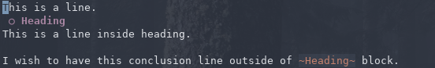
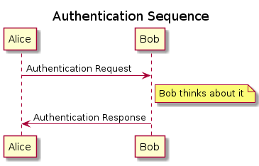
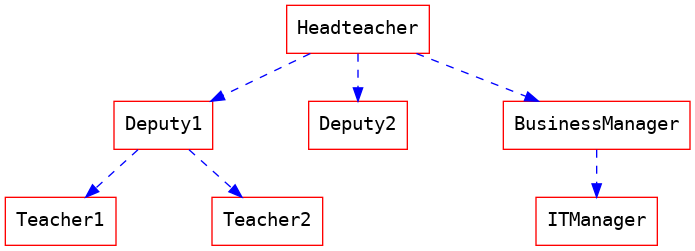
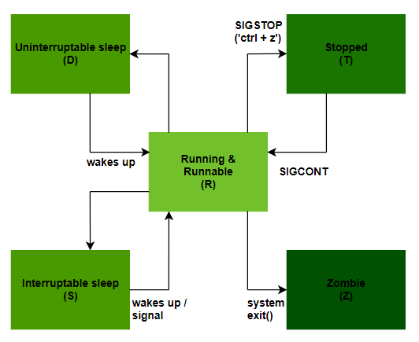
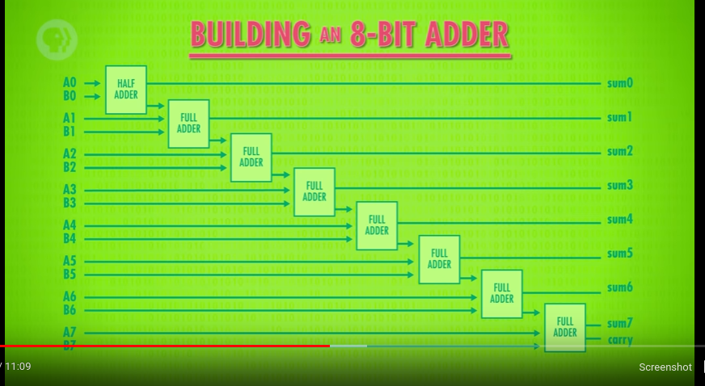
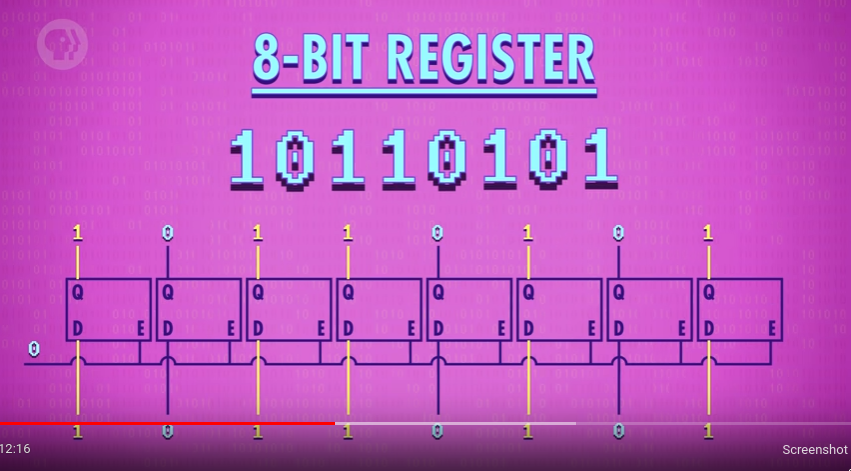
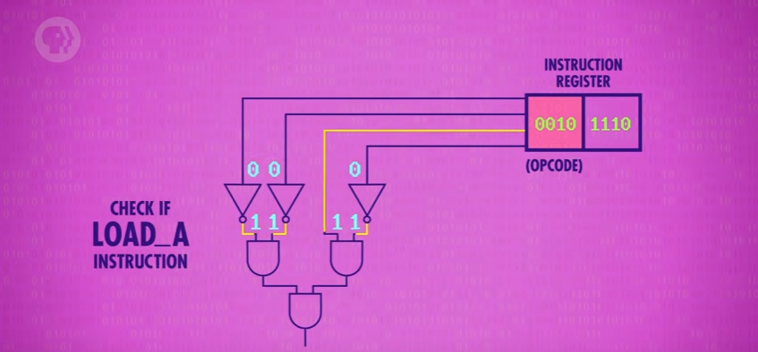
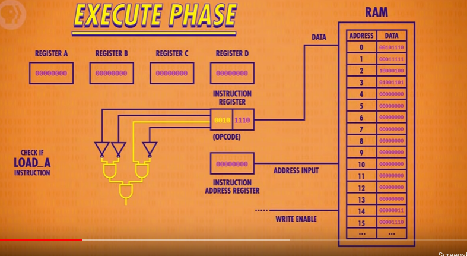
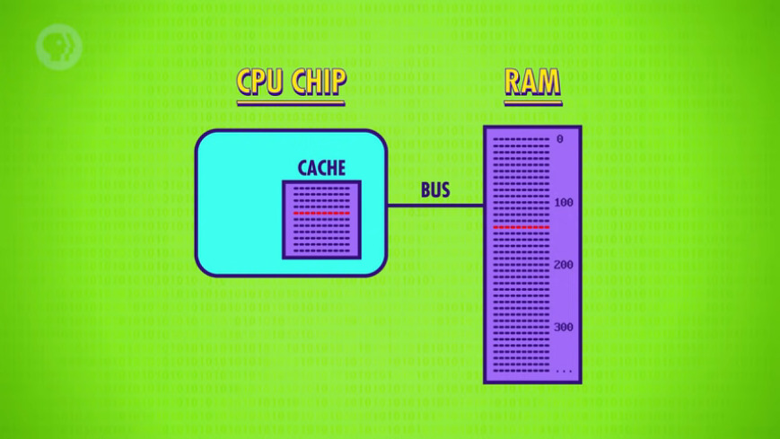
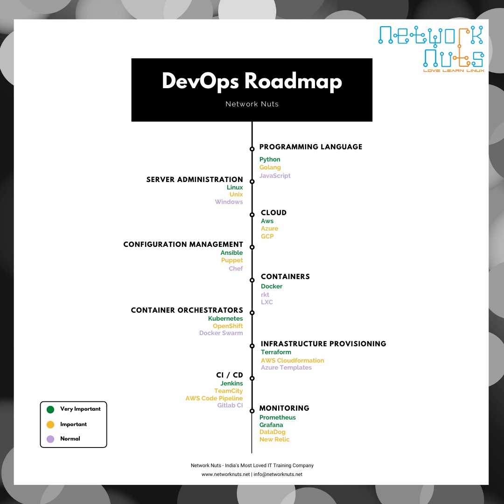

#+SETUPFILE: https://fniessen.github.io/org-html-themes/org/theme-readtheorg.setup
#+TITLE:     Abhijit Paul
#+OPTIONS: \n:t

#+SEQ_TODO: TODO IMPORTANT(I) | COMPLETED(C)

* About me
  A learner. 
I have the following skill set.
1. Expert in c++ and java
2. Swing and JavaFX and Qt5 for frontend
3. File handling for backend
4. ~Data Science~ using Python (Data Cleaning, Curating, Exploration, Visualization, Feature engineering, Modeling, Machine Learning).
* Useful Guides for you
** Is using pc for an extended period of time a bad idea?

It is not. 
*** Hardware lifetime is counted in decades
   Unless you plan to use same hardware for more than a decade, running pc for an extended period is not a problem.
*** Booting up pc also "harms" pc
The sudden surge of electricity also harms the pc. So many people, in past, used to advocate for not turning off the pc at all.
Voltage Spike Protection

When the power supply is suddenly interrupted, it produces a high voltage in most inductive loads. This unexpected voltage spike can damage the loads. However, you can protect expensive equipment by connecting a diode across the inductive loads. Depending on the type of security, these diodes are known by many names including snubber diode, flyback diode, suppression diode, and freewheeling diode, among others.
*** Many people runs their pc 24/7
People who want to access files in their home pc from office, usually just keeps the pc running 24/7.
*** Power cost
It does cost electricity to keep the pc running. A desktop PC typically uses around 100 watts of electricity, the equivalent of 0.1 unit (about 0.2 unit when loudspeakers and printer included.).

In bangladesh, dhaka, 1 unit is about 7 tk.
So you spend 7tk for 10 hours of pc usage.
** How to work with a repository that already has files?
- git init
- git remote add origin https://<authentication>@github.com/your-repo-name/
- git pull origin master 
- git add .
- git commit -m "Initial commit for the sake of testing"
- git push origin master
Now add new files that you want to upload to the repo and do stuffs as usual.
** Find ip and security key of your wifi
- $ ip route 
- Enter the ~default gateway address~ on your browser
- You will enter your router admin login page. Enter the password of your wifi.

** Easily create getter-setter method in eclipse.
When you have to create getter-setter for a lot of variables, its a PITA to manually do them. So instead use -
~alt+shift+s+r~ and from the pop-up window, select the variables for which you want getter-setter methods.
** Implulse-Blocker 
Its a very handy firefox add-on. Block sites that distracts you, like facebook etc. This way, you can focus on the task at hand.
** Don't waste time while learning to code!
  [[https://www.youtube.com/watch?v=s6dMWzZKjTs][Source Video]]
1. Pick a roadmap: Don't read CompTIA A+ one day, js next day and java the other day. Make a roadmap, learn things step by step.
2. Learn one thing at a time: Don't take git and css at the same time. learn css first, then go to git.
3. Don't just passively learn: If you just lazily watch tutorials, you are likely to forget them soon. So rather, practice the materials after watching a video. This might be a bit time-consuming but its faster than learning the same thing 100s of times.
4. Don't just memorize
5. Build the stuff! Learning is just the first step, building is the main step. If you don't build the project, you will forget it very easily.
*** My Roadmap
- Learn Html, Css(This week)
- Learn JS(From 29-Exam)
- Make 10 web project from frontend mentor.(December)
- Learn bash(From examples) (Maybe at leisure?)
- Learn git branching(The basics only) (Maybe at leisure?)
- Go through UI/UX development briefly (December)
- Learn React
- Complete the docker associate certification playlist from udemy
Thats all I need to complete before I reach 2nd year, 2nd Semester. After that, I will focus on devops.
** Recommendation for new Computer
- Buy SSD(at least 250GB) along with HDD(Harddisk). And remember, if you have wifi at home or plan to take one soon, its pretty likely that you won't ever need to download anything. You will watch song online, movie download-watch-delete etc. So you don't need a HDD in such cases.
- Do dual boot with windows and ubuntu. Windows because you are a newbie so you might need it sometimes. Ubuntu because thats what you should be using for the rest of your life. Unless you are a gamer, ubuntu is far better than windows for you.
- Spend more money on RAM. Our processor technology has advanced faster than other hardwares. As a result, a medium grade processor is more than enough. What you lack most of the time is, RAM. So buy 16GB(At least 8GB).
- Don't buy a sound speaker. Instead buy headset.
** TODO How to properly use XiaoMi-4a Router?
** How to see progress when moving a file?
*** Method 1 : Using the package progress.
   This is my preffered method. Its the easiest way to do it as well. progress lets you watch the progress of many commands.
-c/--command: The command you wish to see progress of, cp, mv, dd, cat, sory, zip etc. You can also use pid using ~-p~.
-m/--monitor:  It monitors the progress. Try ~progress -c mv~ and it will only show the current state. Use -m to minitor it.
#+begin_src bash
sudo apt install progress

progress --help

progress -m -c mv
#+end_src
*** Other Methods 
[[https://unix.stackexchange.com/questions/2577/how-can-i-move-files-and-view-the-progress-e-g-with-a-progress-bar][This unixexchange thread]] discusses various ways to do it, like using patched version of cp and mv that shows progress. However, its still not as versatile as progress imo. Because - 
Think of this scenario. You are running the cp/mv/etc process in the background. So naturally, you can't see its progress. Now suddenly, you wish to see the progress. In such case, you can simply do -
#+begin_src bash
pidof mv
progress -p the-pid
# OR
progress -m -p the-pid 
#+end_src
** TODO Why you should custom-build your startup page.
** How to raise a bug
Simply go to the git and raise an issue.
* Linux Guides
** How to get started with emacs?
- Try the basic emacs keybindings
- Its not recommended to immediately start with evil package. However, if you are a vim guy, consider doom-emacs. 
- Tinker around for a month
- Try new packages from various youtube and online channels and choose your own. 

I don't really recommend using someone else configurations and using those packages. If you are already at this stage, consider giving them up and start from scratch. Only this way can you be a emacs user from a emacs newbie - by configuring everything yourself.
** Latex 
Latex can be directly written inside org mode. There is no need for a code block. ~C-c C-x C-l~ converts the latex code into its real representation.
Tips, Increase font size before using latex in org mode, using ~C-x C-+~.
*** Mathematical Expressions 
Mathematical Expressions must be written inside ~$ $~ dollar signs. Like -
#+begin_src text
$y_0 = a^2 + b^2$
#+end_src
Result: :$y_0 = a^2 + b^2$

Remember that, there must be ~no space~ between characters and the dollar signs.
$x\frac{d^2y}{dx^2} + 3\frac{dy}{dx} + x $ -> This is wrong and won't produce output.
$x\frac{d^2y}{dx^2} + 3\frac{dy}{dx} + x $ -> This is correct.

*** Differntial Sign
\frac is used for that.
#+begin_src text
$ x^1\frac{d^y}{dx^2} + 3\frac{dy}{dx} + y = 30e^x$
#+end_src
Result: 
$x\frac{d^2y}{dx^2} + 3\frac{dy}{dx} + x = 30e^x$

*** Superscript
Put the entire superscript in {} if they are more than one character 

1) One character superscript: $a^2 + b^2 = c^2$ 
2) Multiple character superscript: $e^{-2t} + 3 = x^{-12}$ 

#+begin_src text
e^-2t  WRONG output
e^{-2t} Correct output 
#+end_src

** Remote file editing using Google Drive and Emacs
Use rclone to do that. rclone is super handy and kinda necessity when you wanna work with cloud storages.
*** Installing Rclone 
[[https://rclone.org/install/][Use the script installation method for ease of installation.]]
or for manual installation -
[[https://rclone.org/downloads/][Download source file of rclone for your distribution]]
Convert the file into executatable using ~sudo chmod u+x filename~

if they did not work for you, simply run ~sudo apt install rclone~

[[https://www.youtube.com/watch?v=f8K-V3HHDA0][Amazing guide on how to use rclone.]]
Tips: do write down the name you give to your google drive while running rclone config. You will need it later to access your google drive from your machine.
Use your own id and password.
*** Rclone commands
  [[https://www.youtube.com/watch?v=YDF1nBaAptw][Here is a guide]] on many rclone commands but you don't really need them as after mounting the drive locally, you can just treat it like a regular directory and all regular commands will run in it.
   #+begin_src bash
   rclone ls name: # ~name~ is the name of the google drive that you selected at the beginning of the rclone config. But its ok even if you forgot the name, just run the next command(listremotes).
   rclone listremotes
   rclone ls
   rclone lsd
   rclone ls my-gdrive:FolderName/
   There are many other commands in the video but as i don't need them, I am not mentioning it.
   

   #+end_src
*** Now mount it to your machine
 #+begin_src bash
  mkdir gdrive-mount-point
  rclone mount --daemon nameYouGave: gdrive-mount-point
  # Done! You have successfully mounted it locally. Now to check if it works -
  ls gdrive-mount-point 
  df -h # in this list, you will notice gdrive at the end.
 #+end_src
*** Sharing my experience on gdrive remote editing
After mounting the google drive, I went there and opened a text file to edit it. I faced almost zero issue, aside from the fact that it very briefly slows down when saving the file. But thats just a second so it does not pose any noticeable problem for me.
**** To address this slow-down issue during auto-saving - 
[[https://github.com/emacsmirror/ohio-archive/blob/master/old-archive/misc/auto-save.el][auto-save.el]] fixes a directory to save the auto-save files. Which is usually /tmp. This way, my remote files' auto-save files will be saved in /tmp and thus I will experience zero slow down.

It by default works with ~M-x recover-this-file~
#+begin_src emacs-lisp
(add-to-list 'load-path "~/.emacs.d/")
(load "auto-save.el")
(setq auto-save-directory (expand-file-name "~/manual-installation/autosave/"))
#+end_src
** Remote file editing using emacs
- You can use ~sshfs~ to mount the remote file system locally and then you can just treat it as a regular directory and do stuffs. Its useful when you have a lot of files that you have to edit.
- You can use ~find-file~ as well. ~counsel-find-file /ssh:root@ip-address:/home/user/file-to-edit~ works perfectly fine.
** Build a Presentation using Emacs
*** Getting started with ox-reveal
[[https://www.youtube.com/watch?v=avtiR0AUVlo][Covers the basics]]
1. Install using ~(use-package ox-reveal)~
2. Syntax to get started. Press ~space~ to move slides in the presentation.
   #+begin_src org
     :REVEAL_PROPERTIES:
     #+REVEAL_ROOT: https://cdn.jsdelivr.net/npm/reveal.js
     #+REVEAL_REVEAL_JS_VERSION: 4
     #+REVEAL_THEME: moon 
     #+OPTIONS: timestamp:nil toc:1 num:nil toc = table of content 
     :END:
   #+end_src
3. [[https://revealjs.com/themes/][List of themes]] I loved the gray theme, sky theme, night theme, moon mode
4. Appearance of options in a list: ~#+ATTR_REVEAL: :frag (appear)~ [[https://revealjs.com/fragments/][List options appearance]]
5. Show image: ~#+ATTR_HTML: :width 45% :align center~
6. Notes during presentation: Press s to see the notes.
#+BEGIN_NOTES
press "S" to open the presenting window
#+END_NOTES
7. Split window: ~#+REVEAL: split~
*** Zamansky's guide
[[https://www.youtube.com/watch?v=bRoSpJ23Kzk][Source Video]]
The video mainly focuses on - using github to use the presentation with a online link. As the presentation is exported as html file, this can very easily be done. 

You can also create branch and serve the site from there.
*** System Crafter's Guide
He used org-tree-mode. Its presentation inside emacs. Unlike org-reveal, it does not create any html files. I won't be using it as i do care about the themes.
However, its useful when you have to run codeblocks.
set-timer: ~org-tree-slide-play-with-timer~  use this function to set the timer.

#+STARTUP:inlineimage
*** Why use org-reveal instead of microsoft powerpoint?
[[https://towardsdatascience.com/must-know-presentation-tools-for-the-effective-data-scientist-93e618ffc8c2][Source.]]
- Impossible: dynamic, visualization-generating R or Python code snippets in powerpoint
- presentations that benefit from interactive data visualizations generated by Python or R code(reveal.js)
*** Tips on presentation
1. Don't read it line by line. Its very annoying.
2. Explain as if its a story. Explain in your own words.
3. The slide should mainly contain Images, graphs instead of texts. Like you are telling about LBW children and the presentation should contain a graph showing the percentage of LBW in BD.
4. Look at the audience, not at your slides.
** How to use timeshift
  [[http://4.bp.blogspot.com/-1Zs8rotF0lY/VL_j4KhR4kI/AAAAAAAABrM/mvMvSbYaQYs/s1600/options.png][A list of all available commands.]]
1. Create a new timeshift instance. Remeber that,
#+begin_src bash
sudo timeshift --create --comments "A new backup" --tags D

--tags D stands for Daily Backup
--tags W stands for Weekly Backup
--tags M stands for Monthly Backup
--tags O stands for On-demand Backup

#+end_src

2. Restoring a timeshift instance
#+begin_src bash 
sudo timeshift --restore
#+end_src

3. List timeshift instances
#+begin_src bash 
timeshift --list
#+end_src

4. Delete old timeshift instance.
#+begin_src bash 
timeshift --delete --snapshot nameOfTimeshiftInstance
#+end_src
(When your PC is in the restoring phase, don't do any work. It might interfere with the restoring process.)
** Does timeshift backup everything?
Timeshift is designed to protect system files and settings. It is NOT a backup tool and is not meant to protect user data. Entire contents of users' home directories are excluded by default.
However, there is a workaround way to include /home as well.
If you include /root and /home everything is backed up. If you restore such a backup I'll be as if you've never touched the system. If you back up a system, then do a clean install, then restore the backup, it'll be as if you never did that clean install. [[https://www.reddit.com/r/linuxmint/comments/8w3i7o/does_timeshift_backup_installed_apps/][Detail Here.]]
** Vim keybinding for jupyter
Gotta use it.
* TODO Political Corner
* Current Works
** Daily Vim Tips
  [[https://vim-adventures.com/][Vim adventure game! (Amazing but sadly, paid)]]
*** Day 1 : Use Visual mode more often!
Visual mode offers rectangle selection and various other selection methods.

dd-> deletes the entire line along with the EOF. So ddp also pastes EOF wich is a PITA.
To go around it, use visual mode.
Esc v $ d p
[[https://unix.stackexchange.com/questions/13904/how-to-select-delete-until-end-of-file-in-vim-gvim][Source here.]]
*** Gameplay
**** hjkl
1. hjkl to move 
2. End of Line(EOL) and jk
**** web
1. w to move by a word. Word means a variable in programming languages, meaning word can have ~letters, digits and underscore~. ~w~ brings the cursor at the beginning of the next word
2. e positions the cursor to the end of the word.
3. b positions the cursor at the beginning of the word.
**** temp
*** Delete from current character to end of file
D
simply pressing D does that.
#+begin_src text

background-position: top center;
background-position: top center;

After pressing D, 

background-position: 
#+end_src

** Emacs tips 
*** Day 1: Insert link in Emacs
Press C-c C-l to enter new link.
*** Ep 1 (EmacsRocks)
 [[http://emacsrocks.com/e01.html][Link.]]
 or simply use ~evil-visual-mode or C-v~ to select a rectangle region and do stuff with that. Like deleting, replacing text using ~C-x r t~ etc
 #+begin_src java
 // Before using rectangle trick
 class random {
     private static void a = 10;
     private int b = 10;
	private final float c = 10;
 }
 #+end_src

 #+begin_src java
 // Before using rectangle trick
 class random {
     this.static void a = 10;
     this.int b = 10;
     this.final float c = 10;
 }
 #+end_src
*** List all keybindings available in a given buffer
 C-h b
*** Visual block mode with line numbers
 [[https://stackoverflow.com/questions/29405042/increment-numbers-in-visual-vertical-block-selection-in-emacs-evil][Source.]]
 First, select visual-block mode using C-v
 then use 5j to select the lines - in our case, zeroes
 then use C-x r N to replace the zeroes with natural numbers.

 (Sadly the natural numbers are covered in spaces so do a simple keyboard macro to fix that.)
 #+begin_src c
 char array[0];
 char array[0];
 char array[0];
 char array[0];
 char array[0];
 char array[0];
 char array[0];
 char array[0];
 char array[0];

 // convert  to this  

 char array[1];
 char array[2];
 char array[3];
 char array[4];
 char array[5];
 char array[6];
 char array[7];
 char array[8];
 char array[9];
 #+end_src
*** Ep 2 (Emacs Rocks)
 ~digit-argument C-9~
 #+begin_src text
 one
 two
 three
 four
 five
 six
 seven
 eight
 nine
 ten
 1
 2
 3
 4
 5
 6
 7
 8
 9
 10
 // convert this into this -
 one   a
 two   a
 three a
 four  a
 five  a
 six   a
 seven a
 eight a
 nine  a
 ten   a

 #+end_src

 Implementing
 - F4(record macro)
 - C-9 F3 (run the macro 9 times)
 #+begin_src text
 one     1
 two     2
 three     3
 four     4
 five     5
 six     6
 seven     7
 eight     8
 nine     9
 ten     10

 #+end_src
*** Vimgolf
**** Problem : Hello World
 #+begin_src text
 51
 #+end_src
*** Kill buffer and window together 
 C-x 4 0
 kill-buffer-window
*** open org-link in browser
 C-c C-o
*** VimGolf alternative for emacs - puzzlemacs
[[http://www.lysator.liu.se/~ehliar/puzzlemacs/][PuzzleEmacs]]
I have yet to use it, I will update my experience later.
*** Open link/pdf etc from org mode 
Using ~C-c C-o~ or org-open-at-point opens the stuffs in the default browser. 
*** Org export and new line
org-export to html messes up newline in the original document. So we use ~org-export-preserve-breaks~ using src_c[:exports code]{#+OPTIONS: \n:t}
*** org mode and conclusion

In org-mode, all text after a heading (until the next sibling heading or higher-level heading) is assumed to belong to said heading
In other words, what you're asking for is not possible in org.

If your question is mostly aimed at exporting, you may want to take a look at [[https://emacs.stackexchange.com/questions/38184/org-mode-ignore-heading-when-exporting-to-latex][this similar stackexchange question.]]
- [[https://www.reddit.com/r/orgmode/comments/qdeyoq/how_to_insert_text_outside_of_org_bullets/hhnw8sj/?context=3][source]]
*** Exporting org mode as html file
C-c C-e h h
It converts your org file into html, according to the theme you set. The following shows how to set the ReadTheOrg as your theme. Its highly recommended to set ~\n~ to true. This well preserve the newlines of your org mode into the html site.
#+begin_src org 
#+SETUPFILE: https://fniessen.github.io/org-html-themes/org/theme-readtheorg.setup
#+OPTIONS: \n:t
#+end_src

**** Here is a list of html themes available for org-export
 ReadTheOrg
 [[https://github.com/capnfabs/paperesque][paperesque]]
*** Emphasizing texts
   *BOLD*
   ~code~
   =code=
   /it/
   +strikethrough+
   _underline_
*** List in org mode
   ~press Alt+Ret~
Unordered list: +, -
    + asd
    + assdsd
    + aaa
    + sss
    + ffff

We now have a ordered list.
    1. Item 1
    2. item 2
    3. item 3
 [[https://emacs.stackexchange.com/questions/26203/convert-between-numbered-and-unordered-lists-in-org-mode][Convert between ordered and unordered list]]
*** Date Time in org mode
<2021-10-23 Sat>
C-c .
*** Customize Variables
~M-x customzie~ to see all the customizable variables for a package.
*** Save Macros
   ~M-x name-last-kbd-macro~ to save the macro.
   ~M-x insert-kbd-macro~ to load the macro.
*** Auto-completion for Emacs 
   The usual ivy or helm auto-completion does not have these features.
 1. Auto-completion for kill-ring
 2. Can search in the kill-ring
 3. find-file will show preview of the file 
 4. Searching ~M-x lorem mode~ should give me all lorem commands. like lorem-ipsum-mode, lorem-ipsum-sadsad-mode etc.
 5. Keep history of my searches(file search, command search) and suggest them at the top when we do ~C-x C-f~ or ~M-x~
*** Selectrum - Orderless
It gives pretty nice features.
*** Marginalia
- Works well with all package, be it ivy helm or selectrum
- Zamansky recommends it (Main point xD)
- Gives 1-5 all features.
  You can use it to search anything -> searching among heading in a org file, searching commands, files, kill-ring etc.
*** Embark
Its not really an auto-completion framework but its a very very amazing package nonetheless. When you select something, it recognizes it as a text, link or org file selection and brings up all the option available for that selection. Capitalize them, fill the region, sort them etc etc.

*** How to create your first emacs function?
 We can split the buffer and open two files in each of the split buffer using -
 C-x 2
 C-x C-f one.txt
 C-x o
 C-x C-f two.txt

 Find out what functions the keystrokes called to do it, using ~C-h k~ your-keystrokes. We get the following function names using C-h k.

 C-x 2 -> (split-and-follow-horizontally)
 C-x C-f one.txt -> (counsel-find-file ) 
 C-x o -> (switch-window)
 C-x C-f two.txt -> (counsel-find-file)

 Now lets make a function that does the whole thing! When using the functions, you might now know the parameters or return values of the function. In this case, use ~C-h f~ your-function to see documentation on the function. In our case, we used ~C-h f counsel-find-file~ to know about the parameters.

 #+begin_src emacs-lisp
 (defun abj/test-function()
 "This function is a test function. We open two files in two separate buffers."
   (interactive) ;; We need it, otherwise pressing C-c C-8 won't call this function.
   (split-and-follow-vertically)
   (counsel-find-file "one.txt")
   (switch-window)
   (counsel-find-file "two.txt")
 )

 (global-set-key (kbd "C-c C-8") 'abj/test-function)

 #+end_src

 #+RESULTS:
 : abj/test-function

 Use C-c C-8 to test the function.
 You are now ready to make your own function. First, you have to be able to do the function task manually. then find the function names and then simply use them in your function and set a keybinding for the function. You are now ready to make your own function!
*** The Beauty of Emacs IMO
Its in customizing. You can customize everything you want. Have trouble remembering the syntax for comments for all programming languages? Simple, make a function. Trouble remembering if its true or True in a programming language? Simple, make your own mode/function.

Using all sorts of packages must come later. However, its recommended to use emacs the way you want the first one or two months.
*** Enlarge/Shrink split windows
C-x } (enlarge-window-horizontally) 
C-x { (shrink-window-horizontally) 
[[https://stackoverflow.com/questions/4987760/how-to-change-size-of-split-screen-emacs-windows/4988206][Source]]
*** Delete a package in Emacs
list-package
C-s package-name-you-wish-to-delete
press D/d
press x to execute the delete action(s)
*** Org-Export - customize file name and directory
You can customize exported filename using ~#+EXPORT_FILE_NAME: index.html~. 
*** Clear Terminal
For any linux terminal, press ~Ctrl+L~ to clear the terminal. Super handy.
*** Find Word in Current Line 
Shift+V (Select current line)
C-c n n (Narrow region to selected region)
ESC (To unselect)
C-s word
ciw
C-x n w

or in vim style,
#+begin_src text
?the-word RET # ? means search backward
#+end_src
*** TODO Learn Emacs Lisp 
[[https://exercism.org/tracks/emacs-lisp][exercism.io - It has a lot of exercises to learn emacs lisp. RECOMMENDED]]
[[https://www.reddit.com/r/emacs/comments/q386ot/comment/hfujffm/?utm_source=share&utm_medium=web2x&context=3][A big but beginner-friendly project on emacs lisp]]

[[https://ambrevar.xyz/modern-common-lisp/][An amazing aggregation of different sources and a roadmap to learn eLisp]]
[[https://www.gnu.org/software/emacs/manual/html_node/eintr/index.html][Official GNU Emacs guide - Its the best possible roadmap and syllabus]]
*** TODO Learn Org Mode
[[https://orgmode.org/worg/dev/org-syntax.html][Org Syntax]]
[[https://orgmode.org/quickstart.html][Quickstart - Focuses on All org mode features]]
[[https://orgmode.org/features.html][Official Site for Manual]]
[[http://ehneilsen.net/notebook/orgExamples/org-examples.html][Brief overview on ALL the features]]
Tips:
- Use ~C-c |~ to crete a table. Use ~TAB~ to go between rows. ~Shift+TAB~ to move backwards.
- Use ~M-up/down/left/right~ to move columns and rows.
- Use ~Shift+up/down/left/right~ to swap cells.
- Use ~Shift+M+up/down/left/right~ to insert column/rows.
- Convert region into table.(comma separated element into table). first select ~shift+v~, then ~C-c |~ to convert it into table. You can also define your own delimiter instead of the default comma. [[https://orgmode.org/worg/org-tutorials/tables.html][Detail here.]]
#+begin_src text
abhi, shuvo, rahim, karim, salim
| abhi | shuvo | rahim | karim | salim |
#+end_src
*** Evil stuffs from minibuffer 
   Its handy but I won't add it in my configuration to make sure I don't become too evil.
#+begin_src emacs-lisp
(setq evil-want-minibuffer t)
#+end_src

#+RESULTS:
: t
*** Game for emacs keybinding 
[[https://www.shortcutfoo.com/app/dojos/emacs][TRY ITTT]]
*** TODO Diagram/UML on org mode 
plantuml package. [[https://plantuml.com/emacs][Installation guide and test usage]]
[[http://plantuml.com/guide][Detailed documentation on use cases]]
#+begin_src plantuml :file my-diagram.png
title Authentication Sequence

Alice->Bob: Authentication Request
note right of Bob: Bob thinks about it
Bob->Alice: Authentication Response

#+end_src

#+RESULTS:

*** Graphing in org mode using dot 
   [[https://orgmode.org/worg/org-contrib/babel/languages/ob-doc-dot.html][Source Guide]]
   [[https://www.tonyballantyne.com/graphs.html][Detailed Guide with 1000 Examples]]
   Super Handy to do graph stuffs.
Use cases:
- Undirected graph
#+begin_src dot :file test.png
graph graphname { 
                a -- b; 
                b -- c;
                b -- d;
                d -- a;
        }
#+end_src
- Directed Graph 
#+begin_src dot :file test.png
digraph graphname{
		a -> b;
		b -> c;
		a -> c;
	}
#+end_src
- Marking a node 
#+begin_src dot :file test.png
digraph graphname{
		a [label="root" color=Red, fontcolor=Green, shape=box]
                a -> b;
		b -> c;
		a -> c;
	}
#+end_src
- Labeling edge 
#+begin_src dot :file test.png
digraph graphname{
		a [label="root" color=Red, fontcolor=Green]
                a -> b;
		b -> c;
		a -> c [label="Going home", color=Gray];
	}
#+end_src
- Filling a node 
#+begin_src dot :file test.png
digraph graphname{
		a [label="root" color=Green, style=filled]
                a -> b;
		b -> c;
		a -> c [label="Going home", color=Gray];
	}
#+end_src
- Advanced usage like defining single style for all node etc. More [[https://www.tonyballantyne.com/graphs.html][here]].
#+begin_src dot :file test.png
digraph hierarchy {

		nodesep=1.0 // increases the separation between nodes
		
		node [color=Red,fontname=Courier,shape=box] //All nodes will this shape and colour
		edge [color=Blue, style=dashed] //All the lines look like this

		Headteacher->{Deputy1 Deputy2 BusinessManager}
		Deputy1->{Teacher1 Teacher2}
		BusinessManager->ITManager
		{rank=same;ITManager Teacher1 Teacher2}  // Put them on the same level
}
#+end_src

#+RESULTS:

*** Write Greek Letters in Emacs
C-x 8 RET 
Now type "SIGMA" to find and type sigma.
[[https://stackoverflow.com/questions/10192341/how-to-enter-greek-characters-in-emacs][Source]]
*** Zoom In/Out in Emacs
C-x C-+ : zoom in
C-x C-- : zoom out
*** Tex in Emacs
M-x set-input-method tex
Type this - 
#+begin_src text 
\Lambda = x^2 + 2ab + b^\alpha
#+end_src
This will turn into this - 
Λ = x² + 2ab + bᵅ
~Zoom in to see them properly.~
*** TODO Official Emacs Documentation
Its a very verbose unlike typical documentation. Do check it out sometime.
[[https://www.emacsdocs.org/docs/emacs/The-Emacs-Editor][link.]]
** Handy Debian commands for day to day activity
  #+begin_src bash 
snap --list
sudo snap remove package-name 

apt list --installed
apt list --installed | wc -l # to see the number of packages installed

uname 
uname -r
uname -a

htop
sudo poweroff
sudo reboot

uptime
date 
whoami
  #+end_src
** Software Development
*** Thread on Things to learn that benefitted you the most
   [[https://www.reddit.com/r/cscareerquestions/comments/qojbzo/what_is_something_you_took_the_time_to_learn_that/][The amazing thread]]
   Mainly git and SQL.
**** Tips 1 : Learn these 5 things
Your job prospects will be improved if you learn these five technologies:
~Git, SQL, Jira, Azure or AWS, and Docker.~
[[https://use-the-index-luke.com/][Best Starter Site for Database SQL]]
**** Tips 2 : Testing your Software Yourselves before submitting for review
Writing tests for everything and then doing a bit of QA for yourself before requesting reviews. You save a lot of future debugging time, leave an impression of being flawless and cautious.

- What does QA mean?
In this context I'd assume it refers to performing the steps that a QA (Quality Assurance) technician would usually perform. For example, actually deploying it to staging and manually testing the features.
It's a little naive to assume that just because all the tests that you wrote pass, that the feature is flawless. So this step is actually quite important.
Automated tests are more useful to catch regressions.
**** IMPORTANT Tips 3 : MIT Course on Distributed System 
    (Omg, its sooo good)
[[https://www.youtube.com/watch?v=cQP8WApzIQQ&list=PLrw6a1wE39_tb2fErI4-WkMbsvGQk9_UB][The MIT course playlist]]
It covers everything! threads, backups, fault tolerance, cloud replication, cahce consitency, blockchain.
~It tremendously increases your knowledge on backend.~
Do it after learning on Dockering and terraform. Its a must-know skill.
**** Learning DevOps Tools
Terraform, gitlab CI, and AWS services. 

Being able to write an app, write the CI pipeline, and deploy it to an environment without having multiple departments(DevOps) involved has made me so much more productive.

- How to learn amazon aws?
Build an app, deploy, and host on AWS. Just dive right with a tutorial. But to know all the services and have a good foundation, I used acloud.guru. I'm sure there's a lot of resources on his to get started if you Google "learn AWS". Best of luck to you
**** Take my time planning things out before I start coding.
    MAke a flow chart or simply plan in org mode.
Find the todo, schedeuly, requirements.
plan everything ahead!
**** Learn JavScript instead of Java C etc
It's a hot, well-paying skill that barely gets taught in colleges and gets hated on by people who don't take the time to actually learn it.
Learning JS was the greatest career choice I ever made.
**** IMPORTANT Data structures and algorithms
 Data structures -> 6 fig salary :)   

Knowing how to use them has gotten me basically every job I've had now.
I started with taking MIT 6.042J Mathematics for CS (Currently learning). Planning to take MIT 6.006 next. All materials are available online.
[[https://ocw.mit.edu/courses/electrical-engineering-and-computer-science/6-042j-mathematics-for-computer-science-fall-2010/][MAth for cs]]
[[https://ocw.mit.edu/courses/electrical-engineering-and-computer-science/6-006-introduction-to-algorithms-fall-2011/lecture-videos/][MIT DSA Course]] ~RECOMMENDED~
**** Regex
[[https://rubular.com/][a helpful link]]
You dont need to memorize anything. Just knowing the core of regex is good. You can just google later.
**** Anki Cards
A great tool to learn stuffs. especially new languages.
**** Git
Git. Watched a 1hr lecture by CS50 on YouTube and keeping checkpoints when building a project has become much easier.
[[https://www.youtube.com/watch?v=1u2qu-EmIRc][The video.]]
** TODO Git Commands
I still don't know asto how to work with branches.
[[https://education.github.com/git-cheat-sheet-education.pdf][An amazing Cheat Sheet on git commands]]
[[https://learngitbranching.js.org/][Simulation on git branching and more!]]
*** How to pull from a github and start working on it?
This works even if its an empty github. 
#+begin_src bash 
git init
git pull url-you-copied 

git remote add origin url-you-copied, #along with verification id
git remote -v # To vertify that we have typed the correct thing.

git add *
git commit -m "Practice commit"
git push origin master
#+end_src
*** Create a branch in Github
#+begin_src bash
git branch branchName # Creating a branch
git checkout branchName # Move to that branch from current branch(Master)

git add file
git commit -m "Initial Commit"

git push --set-upstream origin branchName
#+end_src
*** Github Page for your project
   - Create a html file/ your webpage.
   - Push it in github. Remember the branch where you pushed it.
   - Now that you are on the right branch, go to setting->Pages->Source and select the branch where you uploaded the site.
   - Click Save.
   - Now you can easily access your webpage online! Here is a example of the URL. https://abj-paul.github.io/Early-Prediction-of-Birth-weight-Based-on-Maternal-Factors/presentation.html
#+end_src
*** Random Commands that I use
#+begin_src bash
git checkout filename # If you mistakenly delete a file 
git merger --abort # If "Exiting because of unfiished merge" error pops up.
#+end_src
* Getting a minimalist browser for me
  [[https://www.youtube.com/watch?v=b8kxdiskGzI][Source Video from distrotube.]]
I don't like bloated stuffs. For a browser, all I need is a window that renders a webpage.
- Auto-hide tabs. Only show tabs when I press Alt+Ctrl+s
- focus-mode: In this mode, all tabs except the one you are in, are hidden.
** surff
It comes from suckless philosophy which says - writing as few lines of code as possible.
- surff takes a considerable amount of time to load even simple page like youtube.
- It has vim-like keybinding
- It uses webkit engine which is terribly slow to render pages.
- It uses tons of cpu and ram apparently, so its kinda broken.
- does not have tab feature
** qutebrowser
   ~USE THIS ONE, IT HAS EVERYTHING~
- hides url bar, tabs etc thus minimal
- Offers a lot of customization
- keyboard driven, vim-like keybinding
- it has history
- Regular speed for webpage rendering even though it uses the same webkit engine. Loading cnn and youtube did not slow down at all.
- It has no bad points hehe
** vimb
A vimlike browser that uses the webkit engine. No toolbar, tabs etc. It does not have tab by default. 
- Its like qutebrowser.
- Regular speed.
- The benefit is - just like vim, you can set text size, color etc in the config file for vimb.
** Min
Its not really much minimal but just for the sake of documentation, its in the list. Its based on a OLDER version of chromium enginer which may have security bugs for not updating to newer version. They literally say it as heading in their home page.
So not gonna use it.
** More on qutebrowser
  [[https://www.youtube.com/watch?v=Av8Sfaprcb4][Source Video]]
Its keyboard-driven webbrowser thats based on qt framework. It does not use webkit, it uses qt web engine which is based on chromium. (Its for the latest version). Its written in python.

It allows high customization but its a lot of googling.

The github is very active. You will get replies very fast if you raise an issue.
- ad blocking
- url format for easy-copy of links to org documents
- close current tab and go to next tab
- vim like keybinding for search bar. (Readline keybinding)
- password management  
** Getting Started with qutebrowser
*** Installation
   [[https://qutebrowser.org/doc/install.html][Insatallation guide for your distro]]
   I am facing ~Qutebrowser needs qtwebkit or qtengine but neither can be imported.~
Installing qutebrowser can be a real PITA if you have Qt, pyqt5, python etc installed both in locally(using pip) and in root (/bin, using apt). So in such case, uninstall the local one using ~pip uninstall PyQt5~.
[[https://www.reddit.com/r/qutebrowser/comments/phjlki/qutebrowser_on_ubuntu_2004_install_error/][This reddit post]] goes deeper into this issue.
*** Configuration
   The config file is in ~/.config/qutebrowser/autoconfig.yml. However, its not recommended to directly write there to set configuration. You can just do it inside qutebrowser command prompt.

:set env.color
:bind a-keybinding
etc

Also, as its written in python, you can just make a config.py and load it up. Though it needs considerate amount of programming skill.
*** some keybindings
   [[https://www.shortcutfoo.com/app/dojos/qutebrowser/cheatsheet][This cheatsheet]] covers all necessary keybindings.
j,k, page-up, page-down, C-f, C-b -> scrollup-down
shift+h -> to go back
yy without selecting anything yanks the url for the page
pp opens the link from clipboard
:y shows all links we can browse. :y ld -> copy link that is marked as ld
gc -> clone the current tab and go there
gO-> open the link typed in status bar in new tab
shift+j,k cycle through tabs
gD -> open the tab in new window. (It auto-splits the window which is super handy. Try this out!)
D -> delete the tab
u -> undo if you accidentally deleted a tab
gl, gr -> move the tab left or right
o qute -> you will find several option in the dropdown. Do visit setting from here. ~It enlists all the variables you can set to control color etc~
o qute -> you can also find bookmarks and quickmarks here. What is quickmarks? Well, Its for opening links faster. We set a keybinding for each link. Lets say, 
yt : youtube.com
now typying :o yt RET will open youtube.
/searchString to search in the page.
?searchString to search backward in the page.
*** Getting Started Tips
1. Run ~:version~ to see all information on it - including the config and data directory path.
2. Generate config.py using :config-write-py
3. For the sake of practice, go to ~/.config/qutebrowser/config.py and type  ~c.colors.webpage.darkmode.enabled = True~. Congratulation! You just wrote your first qutebrowser configuration. Note that, you need to restart qutebrowser for the newly added configuration to take effect. Simply use ~:restart~ to restart the browser.
4. qutebrowser default adblock feature does not work in a lot of sites. speciall in youtube. So we will get ourselves a new adblocker. Unfortunately, there is no direct configuration to do it. What we can do, is, opening the youtube video locally, using ~config.bind('M', 'hint links spawn mpv {hint-url}')~. Now pressing M will let you choose a video and it will open it locally.
#+begin_quote text
Unlike the high popularity, I had terrible experience working with mpv. The video would lag so very often, even though it always run flawlessly on youtube. And not to mention, it did not work with my WM. So I had no choice but to decide on youtube-dl and vlc combination.
#+end_quote

* Data Science
** Sources 
[[https://www.reddit.com/r/datascience/comments/r3eg4m/useful_reference_book_a_mathematics_course_for/?utm_source=share&utm_medium=web2x&context=3][An amazing reddit thread on maths that you will need for statistics. I highly highly recommend doing it!]]
** Matplotlib vs plotly
   [[https://www.youtube.com/watch?v=GzUVacnrgFc][plotly vs matplotlib]]
1. plotly has some stuffs included by default. Like we can select in the plot, zoom in, zoom out etc.
2. Plotly is more focused on the browser and interactive plots that are easy to make. Whereas matplotlib is more professional, more scientific as it has countless customization options.
3. To get a good visualization, we have to cuztomize quite a bit, to the extentent of making small frameworks. But once that is done, we can customize, present it any way and do whatever we want. Matplotlib is just like emacs or archlinux. Once you configure them, you get tremendous control over your work.
4. Though matplotlib has a wrapper around it called seaborn that makes it a bit easier to make plots. Matplotlib is a must for professional Data Analysts. 
5. However, plotly is handy when you are just doing data explotation and don't want to spend too much time on visualization. Plotly is very convenient for EDA.
   TL;DR Matplotlib for scientific and professional stuffs. Plotly for web visualization.
** Interview Questions
[[https://www.simplilearn.com/tutorials/data-science-tutorial/data-science-interview-questions][Start with the video to get to know the unknown concepts. 50 questions]]
[[https://www.youtube.com/watch?v=tTAieUcNHdY][Video, 35 questions]]
[[https://www.edureka.co/blog/interview-questions/data-science-interview-questions/][120 Interview Questions]]

These are really questions for DS which is hard for a beginner. So try Data Analysit interview questions insted.
** Data Science in Emacs 
   [[https://github.com/nnicandro/emacs-jupyter][emacs-jupyter]] is an amazing package for that! [[https://www.reddit.com/r/emacs/comments/qn9hmh/donated_to_emacsjupyter/][Found it in this reddit thread.]]
   [[https://www.youtube.com/watch?v=OB9vFu9Za8w][This youtube video might help]]
   [[https://www.reddit.com/r/emacs/comments/n71hj2/python_how_would_you_configure_emacs_for_data/][more in this reddit thread]]

 1. Install ein
 package-install ein 
 2. Type the following code-snippet in a org file.
 #+begin_src org
 #+BEGIN_SRC ein-python :session localhost
   import numpy, math, matplotlib.pyplot as plt
   %matplotlib inline
   x = numpy.linspace(0, 2*math.pi)
   plt.plot(x, numpy.sin(x))
 #+END_SRC
 #+end_src
 3. Press ~C-c C-c~ to evaluate the code block.
 Notes: Keep in mind that the plots are actually images. You can find it in ./.ein-images. As they are images, you can move them, do whatever you want.
** gcalender
[[https://github.com/slgobinath/gcalendar][A nice CLI for Google Calendar]]
Will look later into - 
[[https://www.reddit.com/r/emacs/comments/5qd8co/best_method_for_orgmode_google_calendar/][Reddit thread for emacs org mode integration with gcalendar]]
[[https://cestlaz.github.io/posts/using-emacs-26-gcal/#.WIqBud9vGAk][A very comprehensive guide to syncing org and gcalendar]]
*** How to use google calendar 
**** Add an event 
Double click on the date you wish to add an event to.
- You can custom occurence to daily, weekly or just selected days.
- You can change how to view your calendar by selecting the options in top right corner(week, month etc). ~Schedeule~ is a very handy calendar view option.
- Invite people to the event by using ~Add guest~
- Create and share new calendar.
** Completing RHCSA Syllabus
*** Manage Local Users and Groups
   [[https://www.redhat.com/sysadmin/local-group-accounts][Red Hat Guide]]
   [[https://www.youtube.com/watch?v=Nm5iT-sAr3A&list=PLKqyiDdtB8i5kk1uzG7q5Qm7INPAPy31E&index=4][Youtube Video for this topic]]
**** Three types of Users.
1. Super User: UID 0
2. System User: UID 1-999, These accounts are locked, meaning you can't login to them. Only system can use them.
3. Regular User: UID 1000+
If we see ~cat /etc/passwd~, we can see a list of users.
#+begin_src bash
cat /etc/passwd
#+end_src
We can see a lot of users here. Almost all of these accounts are system users.
We can check ~/etc/shadow~ to see that, indeed, the system accounts are locked so we can't log into them. (The accounts which have !! in their password section, are locked. If we notice, we will see that they are all system accounts. Thus we can say that system accounts are locked, meaning nobody can log into them.)
**** Creating User
    A normal user can't create other users , You need sudo rights to create a user.
#+begin_src bash
useradd --help

useradd abhi
passwd abhi
tail -5 /etc/passwd

usermod -c "Abhijit Paul" abhi # Add name of the user
#+end_src
- What happens when a user is created?
Certain files are modified when a user is created. They are :
1. /etc/passwd -> Stores general info on users (username, passwd, UID, GID, name, home_dir, bash)
2. /etc/shadow -> stores password. (~!!~ means the account is locked and nobody can log into the account.) 
3. /etc/group -> Stores all groups (Group name, passwd, group id, group members)
4. /etc/gshadow
5. A new directory in the name of ther user(/home/user/). This contains the files that are in ~/etc/skel/~
~So a user only affects five points in the OS.~ 
***** /etc/skel/
It contains -
.bashrc
.bash_profile
.bash_logout -> read/executed when the user logouts.
.bash_history -> all bash commands the user have typed in the terminal are saved here.

.bash_profile and .bashrc are read/executed when the user is loggin in. So we can put alias in the .bashrc and find them every time we log in.
#+begin_src bash
cat .bash_history
#+end_src
***** /home/user directory and permissions
#+begin_src bash
su -
ll /home
#+end_src
You will notice that each /home/user/ has permissions ~rwx --- ---~ This is necessary because if any random person can ~cd(x)~, ~run scripts(x)~ , ~read personal files(r)~, then it is a major security flaw. So only user can rwx in his directory.
- Remember that, ~/root~ is also a user so it also has ~rwx --- ---~ permissions.
**** Groups
    Lets say, we have a marketing team. So its likely that they need some common resources that are stored in a folder. Now instead of giving them access one by one, we can add those users in the marketing group and give access of that folder to the marketing group.
SEE? Groups are super handy.
#+begin_src bash
groupadd students
tail -4  /etc/group

usermod -a -G stuents abhi
tail -4 /etc/group

su - abhi
id
su -
groups

sudo mkdir shared-marketing-folder
chmod u=rwx,g=rwx,o=r /shared-marketing-folder
chgrp marketing-group /shared-marketing-folder

chgrp -R marketing-group /shared-marketing-folder # if it has sub directories

#+end_src

Groups are of two types.
***** UPG(User Private Group)
Whenever a new user is created, he is added into a group of his name. See ~/etc/group~ to see the groups.
***** Secondary Groups
Groups that we manually create using ~groupadd~ command. These groups are empty by default. They are called secondary or supplementary groups.
***** Permissions
read=4
write=2
execute=1, execute for folder means -> people can ~cd~ into the folder.

so
0=none 
4=only read 
5=r-x
6=rw-
7=all permissions

#+begin_src bash
chmod 777 shared-folder
chmod 770 shared-folder 

chmod 764 shared-folder
#+end_src
The default permission for a file is - 
1. File ownership is to the person who creates it and his UPG(User Private Group)
2. Permissions(for a file) are: rwx r-x r--
But who controls these default permissions? 
~umask controls them~
****** umask
For a ~file~, default permissions are (files can't be executed by default) -
~file = 666 - umask~
so 666-002 = 664 = rw- rw- r--
[default umask value=002]
For a directory,
~folder = 777 - umask~
777-002=775 = rwx rwx r-x

So umask value determines default file permissions. We can set umask value using
#+begin_src bash
umask 006
# rwx rwx --- file
# rwx rwx --x directory
umask 066
# rwx --- --- file
# rwx --x --x directory
#+end_src

To permanently save the umask, just save it in .bashrc.
#+begin_src text
umask 006
source ~/.bashrc
#+end_src
***** Give Sudo Privilege to an entire group.
What if we need to give admin privilege to the entirety of usergroup? To accomplish this, we need to create the /etc/sudoers.d/usergroup file:
#+begin_src bash
[root@server ~]# echo "%usergroup ALL=(ALL) ALL" >> /etc/sudoers.d/usergroup
[root@server ~]# su - user02
[user02@server ~]$ sudo cat  /etc/sudoers.d/usergroup
[sudo] password for user02:  
%usergroup ALL=(ALL) ALL
#+end_src
***** A person can be in multiple group
#+begin_src bash
useradd abhi
groupadd a
groupadd b
groupadd c

usermod -a -G a abhi
usermod -a -G b abhi
usermod -a -G c abhi

cat /etc/group | grep abhi
#+end_src
**** Giving a user sudo-rights
In Red Hat, the users in ~wheel~ group has sudo rights. So simply adding a user to this group will grant him sudo rights.
#+begin_src bash
usermod -a -G wheel username

groups username # To verify
#+end_src
**** Locking and Deleting a user
    When a user goes away, we need to first lock the account, then archieve the data and then, according to company policy, delete everything about that user after two weeks.
    #+begin_src bash
      ls /home # List all normal users
      userdel username # Remove him from the four files mentioned above. Only the fifth one, the /home/user is ignored. Because it might contain important files. So userdel does not remove home directory by default
      userdel -r username # Remove everything including home directory,
    #+end_src
**** Aging of Password
Format of /etc/passwd -<> user:password:date when the password was last changed:min(see note):expiration date: expiration prompt date
Note:
min = 1day means, the user can't change the password before the 1 day passes. Note that a user can change his password. And its ok, as root don't need password to access any user account. Try ~su - username~
expiration prompt = 7 means, the pc will prompt the user to assign a new password 7 days before the password expires.

We only care about min, expiration date, and expiration prompt date. Because we need to set expiration date for clients with month-based payment methods. Expire after a month.

~chage~ is a handy command to visualize and edit password aging, Its also important for RHCSA exam.
#+begin_src bash
cat /etc/passwd

chage -l abhi

chage -m 1 -M 30 -w 7 -I 5 abhi 
# -m : user can change password only after a day
# -M : User must change password within 30 days, This password is valid for 30 days
# -w : Warn the user 7 days before the password expires
# -I : The password will be inactive after 5 dats of "-M"

chage -E 2021-12-31 abhi
# Expire means the account will be expired. After the expire date, abhi can no longer long in to the account. 
#+end_src

By default, MAX DAYS = 999999 etc. You can change these default values in ~/etc/login.defs~
**** Questions
- Test with expiration and max days. [[https://www.redhat.com/sysadmin/linux-user-account-management][Red Hat Guide on Expiration]] . After max days, user will be prompted to change his password, nothing unusual. For expiration, ther user can no longer log in to the account. It disables the account.
***** Locking vs Expiring - Whats the difference?
     In both case, the user can't log in to the account and will need admins help.
****** Details
- Deletion will remove the account from /etc/passwd, /etc/shadow etc
- Locking Account means the user can no longer log in to the account using ~ANY~ password. 
- Password Expiration means the user can't log in using that password. However, he can log in using other means, such as ssh from remote machine using SSH keys, as ONLY the password has expired. 

- There are two different things here . First , password expired -> when password gets expired then in the next login user must have to change/reset his password . after password expiry date , he will get reset password prompt as soon as he may try to login . Also , password expired date is calculated using (last password change + max password age ) .

Second , Account expired -> when the account get expired then the password will be expired and also user will not receive any prompt to reset/change password . Now , only root user can help him to login . root user may extend the account expired date or create entire new password with different password expiry information.

So , in short : when password expire , user by its own can reset it but when account expire the user can't change it and can't login at all .

- ~Account Expiration is the same as account locking. The user can't log in to the account anymore.~ The root can access them though.
#+begin_src bash
su -
chage -l abhi
usermod -e 1 abhi # Expires the account 
chage -l abhi

tail -4 /etc/shadow # The "!" means the account is locked.

su - test-user # Root can go anywhere so even in locked accounts, so we need to be another user except root, to test what happens when an account expires
ls
su - abhi # We will get a prompt saying "YOUR ACCOUNT HAS EXPIRED, PLEASE CONTACT THE ADMIN."
#+end_src
Now lets lock an account and see what happens.
#+begin_src bash
usermod -e 2030-12-21 abhi # Un-expiring the account to use it now.

usermod --lock abhi
tail -4 /etc/shadow # The "!" means the account is locked.

su - anotherUser
ls
su - abhi # Authentication error
#+end_src
****** When to use lock and when expire?
The expiration mechanism is needed to expire the account in the future. Say like a service account that can be used for a week or so.

The locking mechanism works only for local password login, not with other login mechanisms like PAM or ssh key.

~man usermod explicitly says if you want to disable an account, you also have to expire it, not just lock it. Therefore, usermod -e 1 username is the correct way to lock an account.~
So ALWAYS EXPIRE ACCOUNT.

***** What does ~Read~ permission mean for a folder?
You can read the list of files in the directory with this permission. Neither can we open the files in that directory, even if we have rwx permission for the respective files.
~In short, we can't read anything in that folder.~
r -> ls,cat will work
w -> touch will work
x -> cd will work
  #+begin_src bash
su -
mkdir -p /shared-folders/checking-read-permission
chmod o-r checking-read-permission

touch {01-50}.txt

su - test-user
cd /shared-folders/checking-read-permission/
ls
# You will encounter error! So we can see that without read permission, we can't list files in the directory.
  #+end_src
***** A user installs some packages. Then we delete the user. What happens to the packages he has installed?
Packages are installed in root-space(/lib, /bin etc) so they do stay whether you add or delete users. We will use a small package ~dos2unix~ to demonstrate it.
 - Remember that, You need ~sudo~ rights to install a package. And whatever we install, are installed in root-user space (/bin, /etc, /lib etc).
#+begin_src bash
useradd testuser -c "Delete it asap"
passwd testuser

usermod -a -G wheel testuser # Giving the user sudo rights 

su - testuser
dnf install dos2unux # WE WILL GET ERROR SAYING "You need sudo permission."

dos2unix --version # So it was installed successfully!
#+end_src
- As we can see, all users can use the package, And its expected, because the package is installed in /lib, /bin, /etc.
#+begin_src bash
su -
dos2unix --version

su - abhi
dos2unix --version
#+end_src
- Delete a user and see if the package persists (and it will persist because packages is in root-space /lib, /bin etc)
#+begin_src bash
su -
userdel -r abhi

su - abhi
dos2unix --version
#+end_src
*** Manage Processes
    -a: All users
    -x: Displays processes not executed in the terminal(making it rather long.)
    -u: shows the user/owner
    -e: Displays extended information
#+begin_src bash
ps aux  
ps lax # More info on processes
pas -ef # User realted info on the process 

man ps
pstree # Show the processes in tree format.
pstree -u abhi # List of Process started by the use abhi

htop/top
h # get help in htop

df -h # df = disk filesystem Memory used by all processes in the system(?)

free -m # Free and used RAM in mb
free -g # Free and used in RAM in gb
#+end_src
**** Java Threading
    Thread is part of a process. So should this work? As we only work with process using px -option commands, so it should not work with thread.
Surprised? We will make threads and daemons and play with them at the end of this portion. [[https://www.tutorialspoint.com/how-to-execute-zombie-and-orphan-process-in-a-single-c-program][Use C to create processes]]
[[https://www.youtube.com/watch?v=3WSL7AOX7nc][Race Condition and Ticket Reservation System]]
[[https://www.youtube.com/watch?v=0nDYk8sV_jQ][Race Condition and ATM System]]
**** kill -9
 Most processes need to clean up temporary files and wrap up properly before being terminated. As a result of kill -9, there is a risk of unexpected problems, that are difficult to debug. That is why we highly recommend you only use kill -9 if you don’t see any other ways to solve this problem. 
**** What is a process?
After birth, human give birth to children. ~(child process)~ The children live in their own surrounding, using whatever resource is given to them. ~(process is in running state.)~
Human wait for something to happen before starting the next stage of their lives. like they wait for marriage to start the marital life, they wait for job to start professional career etc ~(Processes wait for something to happen before going to the next state)~
Every human must die ~Every process must die.~

- Linux is a multi-process OS, meaning we can run many processes simultaneously.
- Each process run in its own space. If one program crashes, that does not affect other processes. 
- ~Space~ here means that, if we start a process in ~/Desktop/E
- The processes in different space can't communicate.
- The kernel maintains the processes. It divides the resources (CPU, RAM, HDD) among processes in fair manner.

**** Process Types
***** User Process
- Started by a ~regular~ user. 
- They run in the user space. And the processes have no access to files that the user does not have access to.(If they had, then it would have caused a major security flaw as the process could then see, read unintended files.)
***** Daemon Process
~Daemon process names usually ends with "d", like httpd, systemd etc~
- Designed to run in the background. 
- They are called service in windows. 
- 'httpd', 'crond'. 
- These processes are managed as services by the root. 
- But daemon processes don't run as a root. They are run by non-root user. Normally, a user account is created that is dedicated to the service. For example, we have user ~httpd~ for httpd service. (cat /etc/passwd). The services run as these users. So in case the apache is compromised, the hacker will have no access to root or the regular user space(abhi, sawon, shuvo) because he can only access as ~apache~ account which has its own separate user space. ~Thats why every service creates its own user account.~ It makes the pc very secured.
- Some daemons allow us to control it (systemctl start/stop daemon). 
- daemons normally start at boot time and run till the system is shutdown. But we can also start/stop some daemons using ~systemctl~ command.
***** Kernel Process 
- They are similar to daemon but they run in the kernel space.
- Primary difference is: Kernel process has full access to kernel data structure that makes them more powerful than daemon process.
- For changing the  behavior of daemon process, we can just change the configuration file (e.g. apache .config file). But to change the behavior of kernel process, we need to completely recompile the kernel. Its also another security feature, as kernel processes have huge power.
**** IMPORTANT Process States
~NOTICE THE LINK~  [[https://jaxenter.com/linux-process-states-173858.html][Amazing guide on process states]]

Only one process can run in the processor at a time.
PID = process id 
PPID = Parent PID
UID = ID Of the user who started the process 
PRI = pritority 
NI = nice value 
VSZ = Vertual Memory in KB
RES = Physical memory in KB
SHR = Shared Memory in KB
STAT = state (5 states)
TTY = Which terminal the process is attached to. ~?~ means the process is a daemon process.
We have 5 process states.
D = Uninterruptible Sleep (It will wake up when a condition is met. We can interrupt it/kill it using any commands. Only shutdown or reboot can stop it.)
R = Running
S = Sleeping (It will wake up when a condition is met. We can also wake it manually, as its not uninterruptible. Using Kill Command Can kill them)
T = Traced or Stopped(SIGSTOP signal was given, We can conitnue it/make it in Running state using SIGCONT command. In linux, when we press CTRL+Z, it issues a SIGSTOP command and puts the program in STOPPED state. We can use SIGCONT to make it back into running state or SIGKILL to kill it.) 
Z = Zombie (Detail below)
***** Parent and Child process
- Each process spawns from a parent process. 
- Most of the commands we type, have shell as their parent, as shell spawns that process.
***** Orphan Process
Normally child process finishes execution and is automatically killed with SIGCHILD signal and the parent knows of the termination of tht child process.
But sometimes, the parent process is killed before the child process finishes execution. Then the child process becomes orphan process.
- If a parent dies before a child, the init takes care/adopts an orphan, executes it and reaps it automatically. Its called ~re-parenting~
- Difference between orphan and zombie process is, orphan processes consume system resources, zombie process don't.
- As all orphan process has ~system init(PID 1)~ as its parent, we can easily find them.
- Intentionally orphaned process: Sometimes, a parent might spawn a child process which will run for a long time, or a infinitely running service. In such case, having the parent in the CPU wastes memory. So the child process is intentionally orphaned. In such cases, we can create a low-cost process and tie the child to that process.
- Unintentionally orphaned process: It occurs when parent process crashes. So we should manually kill those processes.
- However, we don't usually see orphan processes because they are managed by a process group system. Lets say, when a user log outs, which processes should we kill? Even complex, we ssh into server as abhi, run some process, we again ssh into the server as shuvo and run some preocesses. Then we exit/logout as abhi. How do the kernel recognize which processes were run by abhi? Its done using process group session. It groups processes based on session, uid etc and make the session as the parent id. When the parent process dies, the children are orphaned and are killed using SIGHUP signal. [[https://www.informit.com/articles/article.aspx?p=397655&seqNum=6][Details Here.]]
- Too many orphan process is bad, as that will overload init process. 
  #+begin_src bash
 ps -elf | head -1; ps -elf | awk '{if ($5 == 1 && $3 != "root") {print $0}}' | head
  #+end_src
***** IMPORTANT Zombie Process
     [[https://dzone.com/articles/zombie-processes-a-short-survival-guide][Amazing guide on Zombie Processes]]
- A process that has bee killed but still shows its entry in the process list. 
- The process actually has terminated. It has released the data structure and resources it holds. However, it will not release its slot in ~process table~, Instead it sends SIGCHILD signal to parent process. Now its upto the parent process to release the child process slot in the process table. 
A child process remains in zombie state from when it sends the SIGCHILD signal to parent process and until the parent process decides to remove it from the process table.
- Formally, When a child process is terminated, the kernel keeps some information about it in the process table (including its exit status). The parent needs to read the exit status of the child before it removes the child’s entry from the table. A child process must always become a zombie until its status is collected by its parent.
- You can't use SIGKILL signal to kill a zombie process as the process does not exist to begin with. So instead, we send SIGCHILD signal to parent process. This signal tells the parent process to clean up its child zombie processes.
#+begin_src bash
kill -s SIGCHILD parent-pid

top | grep zombies  # LIST ALL ZOMBIES
ps aux | grep -w Z 
#+end_src
Sometimes this may not work if the parent process wasn't programmed properly to handle SIGCHILD signal. In such cases, we have to kill the parent process to kill the zombie process. If even killing the parent does not remove the zombie, then its a system-level bug!
- But are zombie processes harmful? Zombies are harmless. Zombies don't consume any resource. However, too many zombies is bad. Because the system only has a limited number of PIDs and only one process table to show them. So if there is too many zombie processes, they will eat up many pids(as every process that stays in the process table has a pid, linux process table has only 32767). That might be annoying and even problematic.
- Too many zombie process means ~BUG~ in that parent process. It is a parent’s duty to reap its dead child, and if you have a parent process that leaves too many zombies, that is a bug of the parent, and the best solution is to fix it.
***** Daemon Process 
- System related background processes that run with the permission of the root.
- They wait for certain condition to be met.
- When ps -ef is executed, the process with ? in the tty field are daemon processes.

**** Kill Process
    killall -9 process can lead to ~data corruption!~
#+begin_src bash
pidof firefox
kill the-piddle

kill -l # List of all kill signals 
15 -> SIGTERM, terminate the signal gracefully # DEFAULT
9 -> SIGKILL, forcefully kills the program, #may lead to data corruption!

pgrep firefox # similar to pidof

killall -u user-name # Kill all processes run by user alok 

pkill -HUP syslogd # By sending HUP signal, we are forcing the syslogd file to re-read its congiguration.
#+end_src
**** Priority of Process
Why should we change the priority of a process?
1. Opening a heavy application can result in resource-lack for other processes. So we can make it lower priority. 
2. We wish to backup and we wish to do it faster. Then we will increase its priority so that it gets allocated more resources to the kernel.

~We change/control process priority with its nice value. So lets look into nice values.~
***** Nice Value
 How much its nice to the ~CPU~
We wish to allocate more resources/cpu to High pririty processes. So its consuming more of cpu, meaning its being mean to the cpu. So its nice value is less (negative).
Similarly, low priority consumes less cpu -> nicer to cpu -> positive nice value
#+begin_src bash
nice

pidof firefox
htop
r # Use the process id to renice the nice value to the number we enter e.g. -10

pidof firefox
ps lax | grep firefox 
renice -n 10 -p pid-of-firefox # Renice/replace/renew the nice value of  the process.

nice -n 10 google-chrome # Define the nice  value of the process while opening it.
#+end_src
**** Jobs
- ctrl+z to stop background jobs
#+begin_src bash
seq 100000 > bigfile # This process will take a long time so we will put it in the background.
seq 10000 > bigfile &

jobs

fg jobname
#+end_src
**** Questions
- Play with java and processes
- orphan state and what does that state mean?
- How can a daemon process that is run by service user, can access my-user resources?
- What is process space? Can a process that is spawned at ~/Desktop/Everything acces its parent directories?
*** Controlling Services 
Control services and daemons using systemd and systemctl command.
**** When is Systemd loaded?
1. Boot process begins with reading the BIOS(Basio I/O System).
 Then hardware initialization (bios intitializes the hardwares).
2. Boot loader is loaded - GRUB
3. Boot loader access MBR(Master Boot Record) on HDD.
4. It uses the data from MBR to start linux kernel/
5. Systemd is the first process started by the kernel. (PID 1)
6. Its the duty of systemd to start all necessary daemons, processes to run the system.
**** What is Systemd?
Systemd is a system and service manager. 
- Its compatible with Sys V init scripts (that is used in the previous version of RHEL, EHEL 5,6)
- Allows parallel startup of processes at boot time thus reducing boot time.
- Systemd introduces a concept of ~system units~
- These system units are represented/controlled by unit configuration files. And these files are read in this order.
    - /etc/systemd/system -> Managed by admin, highest priority
    - /run/systemd/system -> Created at runtime
    - /usr/lib/systemd/system -> distributed with package instllation.
#+begin_src bash
cd /etc/systemd/system/
ll

systemctl get-default
cd graphical.target 

cd /run/systemd/system
ll 

cd /usr/lib/systemd/system
ll
 
#+end_src
**** What is system unit?
Systemd controls all processes. The systemd itself is controlled by the unit configuration ~files.~

Any resource that the OS knows how to manage and operate.For example,  pseudorom, lan card, partition, service, sockets etc.
These units are defined with those 3 configuration files mentioned in systemd section. So these files are called ~unit files~.
We have :
- service units
- socket units
- mount unnits
- path units etc

See all the processes and daemons which the systemd is managing. systemctl is the command used by systemd to manage the services.
#+begin_src bash
systemctl # Lists all units controlled by systemd 
systemctl --type=service # See only the service units 

systemctl status sshd.service 
systemctl status sshd # It by default persumes as a service. So no need to write sshd.service. Writing sshd is eough.

systemctl is-active sshd
systemctl is-enavled sshd

systemctl restart sshd  # REARELY USED
systemctl reload sshd 
systemctl stop sshd 
systemctl start sshd 

systemctl enable sshd # Activate the service after booting 
systemctl disable sshd 

systemctl list-unit # List all units 

systemctl list-dependencies httpd # A service often have other dependency services. Using this command will show all the services that systemd will activate as dependency when we start the httpd service.
#+end_src
**** An interesting fact about systemctl Enable/Disable
When we enable a service, we are setting it to start when the os loads up. And as we know, os loads everything up with systemd. So what we want is, letting systemd know that we want this service to start at boot time.
Use these commands and see the message they show.
#+begin_src bash
systemctl disable sshd
systemctl enable sshd

cat /usr/lib/systemd/system/sshd.service 
#+end_src
The message is -
#+begin_src text
Created symlink /etc/systemd/system/multi-user.target.wants/sshd.service → /usr/lib/systemd/system/sshd.service.
#+end_src
~multi-user.target.wants~ is a very important folder for systemd. When we wish to enable a service, systemctl creates a symbolic link to that service in this ~multi-user.target.wants~ folder. This way, systemd can boot up the service during startup as systemd reads /etc/systemd/system/ files when loading up.

It also means that simply removing or manually adding a symbolic link here can make a service start at os start-up.

**** Edit sshd unit configuration file
If you go to the unit configuration file that you found in the earlier section when using ~systemctl disable/enable sshd~, you can edit it to change the behavior of that system unit!
#+begin_src bash
cat /usr/lib/systemd/system/sshd.service 
vim /usr/lib/systemd/system/sshd.service 
#+end_src
If we notice, we will see these lines -
#+begin_src bash
Restart=on-failure
RestartSec=42s
#+end_src
It means, even if we stop or kill the sshd process, it will start back after 42s. We can try it using -
#+begin_src bash
systemctl status sshd # READ PID from the details shown.
kill pid-of-sshd

systemctl status sshd # The status will say "auto-restart"
# WAIT FOR 42s
systemctl status sshd # status=active
#+end_src
We don't really need to know the file location of the unit configuration file of the process. (e.g. /usr/lib/systemd/system/sshd.service ). We can instead use -
#+begin_src bash 
systemctl edit --full sshd.service
systemctl daemon-reload # We need to reload the service for the changes in configuration file to take effect.

systemctl cat sshd.service
systemctl show sshd.service # Detailed low level details. Dont really need it.
#+end_src

**** Questions
***** What is system unit?
[[https://www.digitalocean.com/community/tutorials/understanding-systemd-units-and-unit-files][Detailed Guide]]
- Systemd is a init-system that increasigly more popular are using rhese days. Systemd uses unit files(Which are just configuration files for a service). The word unit is comparable to services or jobs in other init systems. However, unit is a much broader term. It includes all sustem resources -> services, network resources, devices, filesytem mounts, isolated devices etc. 
- Systemd has the link to configuration files to manage these units in its /etc/systemd/system, /usr/lib/systemd/system and /run/systemd/system folders. When the kernel starts, it spawns the systemd process and the systemd process goes through these configuration files(is termed as unit files) and loads up the units.
- Unit includes: .service, .socket, .device, .mount, .automount, .swap, .target, .path, .timer, .snapshot, .slice and .scope [[https://www.digitalocean.com/community/tutorials/understanding-systemd-units-and-unit-files][Individual details can be found here]]

***** What is a socket?
Sockets are like pipes in command line. Sockets allow communication between pc and network. Sockets always have an associated service that will be started when acitivity is seen on the socket. 
*** Understanding SSH 
Old methods of accessing remote server were -> telnet, rlogin, rsh. Telnet transfers everything in plain text which is a major security flaw, as anyone can sniff the data and read the contents, like my root password.
Lets do it ourselves! We will use tcpdump, a tool used to sniff/get the packages from the network and read them.
1. Create a server and install telnet 
2. Go to client server and install telnet
3. telnet client-server-ip
4. Go to another server and install tcpdump. 
5. Sniff and Read.
#+begin_src bash
systemctl start telnet
systemctl status telnet 

telnet ip-addr-of-client

ip a s # In client server. We need the name of the interface through which the server is recieving info from the network.

yum install tcpdump # In Another hack machine 
tcpdump -w mySniffFile -i interface-name
#+end_src
**** TODO Why is SSH Secured?
We will sniff the network now when using ssh connection.
#+begin_src bash 
ssh root@ip
ip a s

tcpdump -w mySniffFile -i interface-name
#+end_src
We will get encrypted texts that we have no way to decrypt. Thus ssh is secured.
**** SSH Verification in Two Ways 
    1. key-based authentication: Its much more secured. We should always do key-based auth instead of password based auth.
    2. password-based authentication: Machine prompted me whether I trust the machine or not the first time I tried to log in. What it did is, it saved the ~FINGERPRINT~ of the machine in the list of known_hosts. So the next time we try to log in to the machine, we can do it securely. This fingerprint mechanism saves us from IP spoofing and MITM(man in the middle) attacks.
**** Why is Key Based Authentication more secured than Password based authentication?
Password based authentication is vulnerable to bot-attacks. A bot might try all combination and find it.So we should use key-based authentication.

/root/.ssh/ stores private and public key. We need to send the public key to the remote machine.
The public keys of incoming ssh sessions are stored in /root/.ssh/authorized_keys
#+begin_src bash 
ssh-keygen # Generating public and private key.
ssh-copy-id root@ip-address

# Log in to the ip-address server 
cat /root/.ssh/authorized_keys 
#+end_src
After generating the keys and copying the public key to remote machine, you will no longer need any password to log in to that machine, as it will simply check public and private keys to verify you.
~NEVER SHARE YOUR PRIVATE KEY~
**** TODO SSH and IP Spoofing
A account can only log in through ssh if it has the correct ip and ~FINGERPRINT~. The fingerprint is exclusive to a machine. No two machine can have two fingerprint.

Now lets say, we 
1. Shut down the original server and note down its ip.
2. Open another server and manually chages its ip to the ip we noted down. (We can easily do that.) Now our hacking server and original server has same ip.
3. Lets try to ssh to the client server with this ip now. We will get the warning -
#+begin_src text
WARNING: REMOTE HOST IDENTIFICATION HAS CHANGED!
IT IS POSSIBLE THAT SOMEONE IS DOING SOMETHING NASTY.
#+end_src
How did the ssh understood that? It understood it through fingerprint. It saw that the new machine has the same ip as the original server but different fingerprint. So it must have spoofed the ip or is doing a man-in-the-middle attack.
~Fingerprints are stored in /root/.ssh/known_hosts~
**** SSH Logs
- We can check currently logged in ssh sessions this way.
#+begin_src bash
w
cat /var/log/secure/

last
lastb
#+end_src
**** Restrict the commands a user can use 
    Lets say, a user should only execute certain commands. He does not need access to the many other commands. So we should restrict the commands he can use.
- Before restricting a user, we need to know that we can run commands without using the bash of the remote server. We can pass the commands using ssh. And this means, ssh can force a user to not access the remote bash and rather send the commands through bash(see the next example) and this way, ssh can control which commands to run.
#+begin_src bash
ssh root@ip-address "cal"

ssh root@ip-address "df -h > /tmp/diskfree.txt"
ssh root@ip-address "cat /tmp/diskfree.txt"

ssh --help 
#+end_src
- We define the commands that the user can run in /root/.ssh/authorized_keys in remote server.
  #+begin_src bash
vim /root/.ssh/authorized_keys
# At the beginning of the file, Write 
command="/usr/bin/top /usr/bin/ps " ssa-rsa ..........(the codes)
  #+end_src
How to fix it?
well, this only applies for a ssh login, not a log in from local machine. So first, log into any other account and from there, be the root in the local machine(Its local so ssh restriction won't work). Then go to the /root/.ssh/authorized_keys file and delete the command section you added.
poof! You are good to go.
**** X11 Forwarding
My main machine has gui. Now If I want to run a gui application(e.g. chrome) in remote machine, I can't run it, as it does not have a gui.
In this case, we can do X11 forwarding through ssh and use the local machine's gui to launch a application from remote server.
#+begin_src bash
ssh -X root@ip-address
#+end_src
If you encounter error, ssh using -v (verbose) to get detailed info.
#+begin_src bash
ssh -v -X root@ip-address
#+end_src
I notice this error message. So i should install a xauth program now.
#+begin_src text
debug1: Remote: No xauth program; cannot forward X11.
So do -
dnf install xauth
again try,
ssh -v -X root@ip-address
We get message to enable cockpit.socket
So we do,
systemctl enable --now cockpit.socket 
We log in again and this time, no error! So lets install firefox and run it.
dnf install firefox
firefox
And poof, it works!

#+end_src
[[https://stackoverflow.com/questions/38961495/x11-forwarding-request-failed-on-channel-0][StackOverflow post on it]]
**** Config files
ssh_config -> its not a daemon so client side configurations.
sshd_config -> daemon so server side.
#+begin_src bash
vim /etc/ssh/sshd_config 
#+end_src
We can do ~PermitRootLogin NO~ in the sshd_config. This way, no other machine can log in to my machine as a root.
We can also deny a certain user(s).
#+begin_src bash
vim /etc/ssh/sshd_config 
DenyUsers abhi
#+end_src

Check ~/var/log/secure~ to see all the ssh login activity to your machine. It can be handy to identify hacking attemps! Also, we can use last/lastb to see who has tried to login to our machine. (lastb only shows bad logins.)
#+begin_src bash
cat /var/log/secure

last 
lastb
#+end_src
We can also set banners(It means, text that will be present at the top when we log into the bash of that machine, like "Welcome to our server!" or "This is email server that also hosts telnet")
Remember that, as we define the banner in /etc, all the users will get this same banner message when they log in.
#+begin_src bash
man sshd_config

vim /etc/ssh/sshd_config

Add -> Banner /etc/our-banner

vim /etc/our-banner
#####################
This server hosts NEXTCLOUD and EMAIL SERVER.
#####################
#+end_src
There is no local config file by-default. However, we can manually crete them. The global configurations are overriden by local configuration(if exists.)
**** Installing telnet
    As its an old package, direct methods like ~yum install telnet && sytemctl start telnet~ might not work.
    [[https://unix.stackexchange.com/questions/635197/failed-to-start-telnet-server-unit-telnet-service-not-found][Detailed Guide]]
#+begin_src bash
sudo yum install xinetd telnet-server telnet -y
sudo systemctl start telnet.socket

sudo firewall-cmd --add-port=23/tcp
sudo firewall-cmd --reload

telnet localhost # To test the connection
#+end_src
**** IMPORTANT Summary
***** password based authentication 
Fingerprint is a security mechanism here that stops ip spoofing. The fingerprint is stored in ~root or user/.ssh/known_hosts~.
***** key based authentication (ssh-keygen)
     generates public-private key
     copy public key to trusted servers and add it in authorized_keys list.
     
     when a new ssh-connection comes, checks if its public key matches any in authorized_keys list. 
     If they match, send a random message to that connection by encrypting it with public key and see if that machine can decrypt it(using their private key). The ssh-connection sends back the encrypted message.
     If the recieved message and original message are same, then log in!

     ~every command, message, text in the connection are similarly encrypted using private-public keys~
***** Configuration files
ssh has both global and local configurations.
- Global: /etc/ssh/
- local/user-specific: ~/.ssh/ or /root/.ssh/ (root is also a /user/ ).
***** Global configuration Files
It includes ssh_config, sshd_config, ecdsa, rsa public-private keys. These keys are used by sshd daemon (The daemon uses ecdsa key in normal cases, but it has to use rsa for ssh1 network protocol and the other one for ssh2 network protocol.)
#+begin_src text
 1. moduli : rule to generate security key.
 2. ssh_config : The system-wide default SSH client configuration file. It is overridden if one is also present in the user's home directory (~/.ssh/config).
 3. ssh_config.d : not necessary.
 4. ssh_host_ecdsa_key : used by sshd daemon. As services use the same global configuration, stuffs for all users. 
Lets say, if we had these security keys inside the respective user of the service, then it would be a pain for the sysadmin to find them. As they are all in /etc, its easy to configure them. And they are not in local user space because why generate different keys, configurations for the same daemon over and over again?
 5. ssh_host_ecdsa_key.pub : same as above 
 6. ssh_host_ed25519_key : same 
 7. ssh_host_ed25519_key.pub : same 
 8. ssh_host_rsa_key : same 
 9. ssh_host_rsa_key.pub : same 
10. sshd_config : configuration for daemon. Daemon configurations are global. There is no local configuration for a daemon.
#+end_src
***** Local Configuration Files 
     [[https://web.mit.edu/rhel-doc/4/RH-DOCS/rhel-rg-en-4/s1-ssh-configfiles.html][Details]]
#+begin_src text
 authorized_keys -> list of public keys. Whenever a new ssh-connection request comes, ssh tries to find the public key of that connection in this list. 
 id_rsa -> The private key of the user 
 id_rsa.pub -> the public key of the user 
 known_hosts -> used for password based login. It stores the fingerprint to secure from MITM and ip spoofing attacks.
#+end_src
**** Question
***** How does key based auth work and why is it more secured?
[[https://www.youtube.com/watch?v=AQDCe585Lnc][This video explains private and public key so well]]
***** How does SSH use private-public to connect without password?
At SSH connect time, the client receives the servers public key, and verifies if this matches the stored public key in $HOME/.ssh/known_hosts. If this test is successful, and the server does not have the clients public key, a password is required. Else, the server sends a message encrypted with the clients public key and if the client manages to decrypt the message successfully, using its private key, the connect is established.
There are two versions of the SSH protocol, version 1 and 2. The encryptions are tied to the protocol version.Version 1 suffers from security vulnerabilities, whenever possible, version 2 should be used. Most SSH-servers use version 2 of the protocol due to the limitations of version 1. [[https://www.thegeekdiary.com/how-passwordless-ssh-works-in-linux-unix/][Source.]]
***** Manually Add Banner for each user/Local Configuration Files for SSH
* TODO Backup Files
Its the most important part of being a linux user - being proficient in backing up your data.
** rsync
Copy the files to google drive using rsync. Pretty slow.
** Image the disk
Apparently, imaging a disk is faster than copying it. 
** My Suggestion
Take a hybrid path. First, make an image of them. Then clone directories.
- Backup timeshift instances online.
- Image /home/abhijit
- Image /dev/sda5
- Image hdd by partitions. Today image drive::E, next day drive::D

- After imaging, back up the important files slowly. It might take a month, Schedeult which directory to update in which day.
* Run a Apache webserver on a VM
** Creating a VM
[[https://www.youtube.com/watch?v=Z2h6eRs5PCo&t=67s][Video on creating a Cent Os virtual machine]]
- Install VirtualBox
- New->Select OS Type(Linux)->Version(Others 64bit)->default for rest of the options that appear next.
Note: I will be using Cent OS 8.
- Download Cent OS 8 iso file.
- Go to setting->storage->empty->See the CD Icon in top right panel. Click on it->Choose a disk file-> Select the ISO File you just downloaded.
Note: What we did is, mounting the ISO So that we can install it later. In the storage option, there is a .vdi file. Its the virtual harddisk(of size 8GB/32GB) you created while creating new VM. 
- Start VM with a normal option.
- Go through the OS Installation procedure.
** Getting Started
Now that you are done creating a VM, you should know something.
1. When you click "Start", You are given three option. 
   - Normal: Yout usual OS, it has a GUI.
   - Headless: Its what we will use all the time. It has no gui. So you need to remotely ssh into this VM to work with it. Its the method thats used in industry.
   - Detached: It can or can't have GUI. We don't really need it.
For detail, [[https://www.reddit.com/r/virtualbox/comments/6g9rj3/what_does_it_mean_when_you_run_your_machine_in_a/][Visit here.]]
2. First, go to setting>network and select "Bridged Adapter". Its necessary because, with the default setting, the main PC and the VM share the same network interface. But with "Bridged Adapter", they have separate network interface so now, they can communicate like two separate remote machines.
3. Now do a "Normal" start. Our goal is to know the ip address of the network interface of the VM. After the device opens, run the command "ifconfig" to see the ip. Note it down.
4. Now poweroff the device. We now need to know of the UID of the VM to be able to launch it from the terminal. For that -
5. Right click on the VM and select "Create a desktop shortcut".
6. Open the desktop shortcut in any text editor. Note down the UID. Its right after ~--startvm~ option.
7. Now you are ready to go! Launch the following command to create a headless instant of the VM.
#+begin_src bash
/usr/lib/virtualbox/VBoxManage startvm "UID of the VM" --type headless
#+end_src

Congratulation! The VM is running in the background now. To use it, we need to ssh into it.
** SSH into the VM
SSH or Secure Shell is a network communication protocol that enables two computers to communicate. [[https://www.ucl.ac.uk/isd/what-ssh-and-how-do-i-use-it][Detail if you are curious.]]
To SSH into the device, simply run-
#+begin_src bash
ssh root@ip-address-you-noted-down-earlier
#+end_src
Type the correct root password and poof, You are now inside the VM!
** The Good to Knows
- You can poweroff the VM using ~sudo poweroff~.
- You can reboot using ~sudo reboot~
- Its highly recommended to create a snapshot of your VM. For that, launch virtualbox and click on the three dots and click "Create Snapshot". This way, you can restore this state if you happen to encounter some errors(which you will if you tinker around like any other linux user.)
- As you saw, its cumbersome to type all that to run the VM. So instead, create a alias for that command. Open ~/.bashrc and add it at the very end:
#+begin_src bash
alias run-VM="/usr/lib/virtualbox/VBoxManage startvm \"UID of the VM\" --type headless"
#+end_src
** What is a webserver?
Normally we type on search bar and we get a website. Several things happen when we type a url:
1. Type abj-paul.github.io
2. The text/string goes to DNS. Its a online list of all known sites. (You have to pay to make your site name appear in that list.) In that list, we find abj-paul.github.io and then the DNS return the ip address for that name.
3. ip address is, literally, a address. We can use ip address to find stuffs online. In this case, ip-address leads us to the device that is serving the website.
4. In that device, we have a webserver. This webserver stays on a port of the firewall and listens to all incoming signals. When it finds a signa to serve the html-css files, it gives that info as a response.
   Summary: Someone has to manage the incoming-outgoing request-responses to view/go to next page/sign up etc actions. Webserver does the job.
** Install Apache Webserver
Remember that installation and configuration procedure for apache is different for debian and Red Hat. As Red Hat is used in industry, we will demonstrate apache installation for centos 8.
- Check if its already installed. (Apache is called httpd in Red Hat, It installs all dependencies automatically.)
#+begin_src bash
rpmquery httpd
sudo yum install httpd
#+end_src
** Run Apache Webserver and Access it from other machines
Apache is a service/daemon. This daemon lurks in port 80 and takes all incoming signals and sends appropriate responses. So -
#+begin_src bash
systemctl start httpd # Starting apache service
systemctl status httpd # Checking if its enabled or not(The blue one)

systemctl enable httpd # Enabling means - this service will start as soon as the system starts. Its not a necessary step but its handy to have it enabled.
#+end_src

If you remember, apache uses the ip of the host machine as the ip address for the website to serve, (If anyone searches your website online, the ip address will lead them to your device and they will connect through the open port 80 and apache will serve them the website). So use ~ifconfig~ to find the ip address of your device. Type the ip address in any browser of other devices(like your mobile). If you can't reach the site/it shows error, it means, firewall did not allow apache to pass through its wall. So we will add apache in firewall's list of services.
#+begin_src bash
firewall-cmd --list-all # In the services section, httpd won't be present. So we will add it now.
firewall-cmd --permanent --add-service http # its called http instead of httpd, dunno why,
firewall-cmd --reload # The firewall needs to be reload for the changes to take effect.
#+end_src

Now you are ready to go! Type the ip address of your host device on any browser and it will serve the default website!
** /etc/httpd/conf/httpd.conf
- ServerRoot: Where the program will look for config files.
- Listen: listen to all client request on port 80.
- DocumentRoot:  Where the html css files will be stored.
** Host your own website
   Note down the file path you saw in  ~DocumentRoot~ in the httpd.conf file. Go to this directory and place your website in that website. Remember that, by default, apache loads ~index.html~ first. If you want to change that, change the value of ~DirectoryIndex~ from httpd.conf file.
- You can serve both static and dynamic site.
** Set a local domain name for your website
   Domain name is the url -> www.facebook.com
You need to pay to set a domain name for your site. This name will be saved in the internet and it will be like (your domain name, your ip address).
Anyway, back to the point, to set a global domain name, you need to pay. So for now, we will set a local domain name.
When you search for a site, the system first checks ~/etc/hosts~ and then the global DNS of the internet. So we will add the ~/etc/hosts~
#+begin_src text
192.168.30.187        www.my-site.com
#+end_src

Now if you type ~www.my-site.com~ in your browser, you will find your site.
* Run a nextcloud service on VM
  This guide follows the [[https://docs.nextcloud.com/server/latest/admin_manual/installation/example_centos.html][official nextcloud installation guide]] with person experience thrown-in. Its recommended to use the official guide alongside it because when you install it, there might be newer versions of php so read this detailed explanation and then use the official guideline.
** Create a User
#+EXPORT_EXCLUDE_TAGS: noexport
Editing files in DATABASE/server as a root, is risky. So its recommended to use a user account instead. 
- Creating a new user account(Just type password, leave the rest blank/Press Enter)
  #+begin_src bash
adduser abhi
password abhi
  #+end_src
- Now we will give sudo rights to this user account, as we will need sudo-authority to install packages. We can do this by adding the user to the wheel group (which gives sudo access to all of its members by default)
#+begin_src bash
gpasswd -a abhi wheel
#+end_src
- Now ssh into the account in the VM.
#+begin_src bash
ssh abhi@ip-address
sudo dnf update && sudo dnf upgrade
#+end_src
** Install and Start Tmux(Optional)
#+EXPORT_EXCLUDE_TAGS: noexport
   Its a optional step but its highly recommended to use tmux for remote editing. 
#+begin_src bash
sudo dnf install tmux
tmux
# tmux attach
#+end_src
** Install apache
   nextcloud is a website-based service, just like google-drive. This website runs on your machine. nextcloud stores data in your ~/var/www/html/nextcloud/data~ directory. And serves the data based on incoming request.
As you can see, we need a webserver to accept incoming requests on port 80 and send appropriate response. Thats why we need apache.
#+begin_src text
We have already installed apache(See the guide above) so we will go to the next step.
#+end_src
** Install PhP
   First, we need to understand what PhP does. 
Lets say, we have a ecommerce site. Now if we write it in plain html-css, then we have to create new index.html whenever a new product is being added, price changes etc. But thats not feasible.

Thats when we have PhP to help us. The products(price, name, amount, shop, reviews) are stored in a server database. Whenever we request the server to show us the webpage, PhP uses the database to generate a html file and sends it to us. 
Thats why we need PhP for nextcloud, as PhP will fetch the files info(creation date, delete date, permissions, shared with) from database and show it to us.
*** Then what does JavaScript do?
JavaScript is a client site language, it executes in the browser. PhP is a server site scripting language, it runs on the server.
Lets say, we wish to show the stock prices. In such case, we will create an api in the server and send responses to the website. The javascript process will pick that response/data and show it to us. (The api may be written in php, as it will fetch data from database and send it to us.)
*** Php Installation
PhP has a lot of dependency, as it uses already existing packages(which is good). So we need to install those dependencies.
- CentOS 8 doesn’t come with packages for the redis and imagick php extensions. We can manually install them but thats a lot of trouble. So instead we use a very famous repo for installing PhP, remi's repository. It has everything + the very latest version of PhP, which is nice. So we will add that repository and install PhP.
Note: dnf is the next version of yum. Its recommended to use it instead of yum.
  #+begin_src bash
dnf install https://rpms.remirepo.net/enterprise/remi-release-8.rpm
  #+end_src
- Your machine should only have one version of php running. So we will first reset the previous version of php and install a new one from remi's repository.
#+begin_src bash
dnf module reset php # This also resolves the dependencies using remi's repo.
dnf module install php:remi-7.4
dnf update
#+end_src
- The installation should be complete. Use ~php -v~ to see if php has been installed or not.
- Now we will install some php modules. PhP modules are php extensions written in c. NAturally, external extensions are not included with php so we have to install them manually. PhP will need these modules to work with MariaDB.
#+begin_src bash
sudo dnf install php php-apcu php-bcmath php-cli php-common php-curl php-gd php-gmp php-imagick php-intl php-mbstring php-mysql php-zip php-xml php-redis -y
#+end_src
** Install Redis
Redis is an open source (BSD licensed), in-memory data structure store, used as a database, cache, and message broker. 
Redis can be used with streaming solutions such as Apache Kafka and Amazon Kinesis as an in-memory data store to ingest, process, and analyze real-time data with sub-millisecond latency. Redis is an ideal choice for real-time analytics use cases such as social media analytics, ad targeting, personalization, and IoT.
#+begin_src bash
dnf install -y redis
systemctl enable redis.service
systemctl start redis.service
#+end_src
** Install MariaDB
   To store the information of files(name, size, updated, shared with, access etc), we need a database. We choose MariaDB
#+begin_src bash
dnf install -y mariadb mariadb-server
#+end_src
- Make sure the database service is enabled to start at boot time because if it does not run, apache will return error as it can't access the database and thus show us files in nextcloud.
#+begin_src bash
systemctl enable mariadb.service
#+end_src
- Its a DATABASE, meaning security is of utmost importance. So we will use the built-in security script. (MariaDB is a fork of the MySQL database management system.) We will first need to start the mariadb daemon/service because when setting up new id/password, the script will communicate with the service for confirmation. 
#+begin_src bash
systemctl start mariadb.service
sudo mysql_secure_installation
#+end_src
*** Temp
    #+EXPORT_EXCLUDE_TAGS: noexport
During the process, we will set new password, remove anonymous users, remove remote root access as its a security loophole if someone can access the entire database as ROOT from REMOTE machines. For the other option, just choose the default(press Enter).
- Create a database for nextcloud. 
#+begin_src sql
sudo mariadb
CREATE DATABASE nextcloud-db;
SHOW DATABASES; # FOR confirmation that we have indeed creted the database.
#+end_src
- Create a user "nextcloud-user"(You can name it anything) and grant it all the privileges to netcloud-db files. This user stays at local host and will be identified by the correct password.
#+begin_src sql
GRANT ALL PRIVILEGES ON nextcloud-db.* TO 'nextcloud-user'@'localhost' IDENTIFIED BY 'a-password'
#+end_src
** Install nextcloud
Now that we are done installing all the dependencies, lets download and install nextcloud. Go to [[https://nextcloud.com/install/][nextcloud download page]] and copy the file link(Right click on ~Download Nextcloud~ and press ~Copy link~).
#+begin_src bash
dnf install wget
wget https://download.nextcloud.com/server/releases/nextcloud-22.2.0.zip

unzip nextcloud-*.zip
#+end_src
- Move the nextcloud resources to ~/var/www/html~ because as you know, its where the website that apache will show will be stored. But before that, move your website/html files that you placed here to somewhere else, we will work on it shortly after.
#+begin_src bash
cd /var/www/html/
ls
mkdir temp
mv index.html temp

cd ~
mv nextcloud/ /var/www/html/
#+end_src
- During the install process, no data folder is created, so we will create one manually to help with the installation wizard:
#+begin_src bash
mkdir /var/www/html/nextcloud/data
#+end_src
- Now give apache access to these files, as apache need to access them in order to show the website.
#+begin_src bash
chown -R apache:apache /var/www/html/nextcloud
#+end_src
- Restart apache for this change to take place
#+begin_src bash
systemctl restart httpd.service
#+end_src
** The Last touch
#+begin_src text
sudo vim /etc/httpd/conf.d/nextcloud.conf

Write this in that file -
<VirtualHost *:80>
  ServerName files.example.com
  ServerAdmin admin@example.com
  DocumentRoot /var/www/html/nextcloud
  <directory /var/www/html/nextcloud>
    Require all granted
    AllowOverride All
    Options FollowSymLinks MultiViews
    SetEnv HOME /var/www/html/nextcloud
    SetEnv HTTP_HOME /var/www/html/nextcloud
  </directory>
</VirtualHost>

sudo systemctl enable --now httpd # For the changes to take place, we need to reload the httpd service.

Configure SELinux:

sudo semanage fcontext -a -t httpd_sys_rw_content_t "/var/www/html(/.*)?"
sudo sudo restorecon -Rv /var/www/html

systemctl restart httpd
#+end_src

Now go to your browser and go to the ip-address of the server. Boom ,you have successfully launched your first nextcloud!
** Get Certification for secured http connection
Create SSL Certificate. [[https://tecadmin.net/how-to-install-certbot-on-centos-8/][Guide.]]
#+begin_src bash
sudo dnf install certbot python3-certbot-apache 
#+end_src
** Sources I used
[[https://www.youtube.com/watch?v=y4dtcr2NL5M][Learn Linux TV Video on it(50min)]]
[[https://computingforgeeks.com/install-nextcloud-on-centos-linux-server/][A helpful online guide on it]]
[[https://docs.nextcloud.com/server/latest/admin_manual/installation/example_centos.html][Official Installation Guide]]
* Exploring Linux Everyday
*** autoremove Command 
When you ~sudo apt remove package~, you are just removing the package, not the dependencies installed with it. So run ~sudo apt autoremove~ to remove all such extra unneeded dependencies.
*** CPU and HDD Temperature 
You can easily see the temperature of harddrive or HDD using ~hddtemp~ package.
#+begin_src bash
sudo hddtemp /dev/sda
#+end_src
As for checking CPU temperature, its a bit more complex. The outputs may vary. Typically, there are two censors in processor,  each indicating the temperature of one core (dualcore CPU). And then, there are some censors around the motherboard. Nobody really knows what each line of the output means. And AMD CPUs' censors often give wrong output. But you don't need to bother about the details that either. Just check if each censor has temperature less than 50 and if they are, its ok!
- acpitz-acpi-0: It means CPU temperature.[[https://askubuntu.com/questions/843231/what-is-the-meaning-of-the-output-of-the-command-sensors][acpitz-virtual-0 is the temperature sensor near/on your CPU socket. This sensor can be unreliable.]] 
- coretemp-isa-0000: Temperature of CPU cores. [[https://askubuntu.com/questions/150794/interpreting-sensors-command-line-output][Source]].
#+begin_src bash 
sensors
#+end_src
Alternatively, you can use ~psensor~. But for it to work properly, you should detect and add all censors this way. [[https://help.ubuntu.com/community/SensorInstallHowto][Source]]
- Run sudo sensors-detect and choose YES to all YES/no questions.
- At the end of sensors-detect, a list of modules that needs to be loaded will displayed. Type "yes" to have sensors-detect insert those modules into /etc/modules, or edit /etc/modules yourself.
Monitoring programs won't work until the needed modules are loaded. You may want to run 'service kmod start' to load them. 
#+begin_src bash
sudo apt install psensor

sudo sensors-detect
#+end_src
*** Make 50 test files 
   [[https://unix.stackexchange.com/questions/395086/creating-50-directories-with-50-files-inside][detail]]
#+begin_src bash 
touch file{01..50}.txt
#+end_src
** IMPORTANT How to build a habit?
Motivation is at its peak once you start.
Like you are unwilling to go outside and run as a exercise. Because, well, its too big of a task.
But you would be more than willing to just wear the shirts and pants, open the door and close it. Thats the first step. And after doing it, you are more likely to at least go up-down the five floors.
So you see, motivation can never come from seeing the long work. Rather, motivation comes after starting working, taking your first step.

So always, ~make your first step easy~ so you can't say no to it.
*** First Step for my internship
My whole plan for today is - EDA.
But first step is - opening the file and doing one visualiation.
*** First step for stat exam preparation 
I need to solve all assignments because the similar pattern questions will come in the exam. Its a big one.
So my first step will be - Just open a assignment and solve 2 questions from it.
** Stomach Bloating 
  Humans have the biggest brain in all of mammals (460% bigger than Monkey.) But bigger organ means more calory consumption. So to balance it out, some organs needed to be shrank downn. And Our digestive system became the one to shrunk down( 40% of monkey). The reason, digestive system, of all organ, was shrank down, is because, with higher interlligence, we can hunt better and more nutrient-dense food. So we don't need to dump lots and lots of leaves, grass in hope we get enough nutrients out of it.
Wheat, rice are some of the famous complex foods. You see, no other animals except human can eat/digest these complex carbohydrate.
*** Stomach bloating is caused by Gas.
   We will use an example to explain this. First, we have A. He has flat stomach in the morning but in the afternoon, his stomach is bloated for no reason.
And then, we have B. He is healthy with no stomach bloating all day.
They go to have a meal together. When you eat something -
1. Digestive acid fills the stomach, gentle contraction of stomach tries to grind the food up.
2. Engymes are used to break down the protein, fat into simpler ones, that are then absorbed in intestine.
3. Most of the food nutrients gets absorbed soon, except for the damn complex carbohydrate, called ~dietary fibre.~ 
4. 70% of the gas is produced in the colon, by biomes. Ideally, the digestive system pushes out the gas from body. So the healthy individual does not experience any bloating. The reason is malfunction. 
You see, when colon has high gas pressure, the epithelial cells are supposed to detect the pressure and send it to the brain and the brain then tells it to contract to get rid of the gas. But for a bloated stomach man, this is not happening properly. The epithelial cells can't detect the bloating properly.
IT has been seen in a research where gas was manually transmitted in digestive system. The bloating group took (20 hour) a much larger time to get rid of the gas than the healthy group(6 hour) and not to mention, the bloating group had, bloated stomach soon after gas injection while the healthy group did not.
Suprisingly, bloated people don't produce any more gas than a healthy person does, from the same food.
*** ~Abdominal Phrenic Disnergia~
You see, we also have another mechanism to fight bloating. As gas pressure increases, it pushes the diaphram upword to get more space. As a result, healthy person dont have bloating even with the same amount of gas as a bloated person, because their diphram moves up to give space to the gas.

But for bloated individuals, the diaphram does not go up, but rahter goes down, The amount of space decreases, so the gas can just bloat the digestive system like a baloon to get the space it needs, and thus we experience bloating.
*** Stomach BLoating Antagonize
   Anyone call fall prey to bloating due to some accidental choices, be it the healthy individuals or the bloated ones.
   First, lets look at the reasons. As we saw, bloating is not caused by more gas, rather all have the same amount of gas. Its caused by incorrect response mechanism to high pressure. And mircobiome, has been recently proven to be an integral part of the system (so its called microbiome-gut-brain-axis sytem).
It has been seen that people who live like our ancestors - the villagers and people in third world nations - experience less bloating. The reasons being - the food we eat, fastfood, chanachur, potato chips, popcorn - are all processed food. And processed food kills most biome, including the helpful ones. As a result, processed food hampers us from getting naturally helpful biome.
Also, heave use of antibiotic also kills many biomes in our digestive system so its also a likely cause.
Amount of Lactobacillus has been seen to be very highly correlated with less bloating and increased level of serotonin, and thus boosting our mood.
There are two antagonizes.
**** Mircorbiome 
Its often forgotten - some call it the "forgotten organ". What they do is, they break down the complex food through farmentation and thus, producing gas. 
**** Food 
*** How come biome, a foreign existen, is part of our digestion controlling nervus system?
Ideally, only limps, cells, body has nerves in them and nerves uses the signal it gets to control the processes. Similarly for intestine, epithelial cells have nerves connecting to it and should control processes appropriately.
But you see, evolution played a role here. Our digestive system got very used to having convenient biomes as convenient places, It has been seen that hundreds of digestive responses and processes directly depends on the secretion of some bacteria. So to sum it up, our digestion and bloating controlling system now  consists of biome+nerves, thanks to evolution.
This has been proven recently as well. Two animal were chosen. One was raised in a germ free sterile environment and the other in the mother nature. The germ free ones had -
1. Impaired immune system 
2. Hormonal Disruption 
3. Smaller in body weight
4. Altered brain function
*** Probiotics 
When people have some infection/disease in colon, the invading bacteria and the given antibiotics just obliterates the biome population. It has been seen that most of them experience bloating due to the disruption in biomes.
However, that can be used by giving biomes through tablet - probiotics. But sadly, there is no single biome that is ~jack of all trade~ in terms of bloating. (However, less number of SCFA biome has been found to be highly correlated with bloating.)
[[https://www.ombrelab.com/pages/marketing-59-ilogic/?utm_source=ilogic&utm_medium=influencer&utm_campaign=JK&transaction_id=1020aa27440a6d35fd057293d1d156][test your microbiomes]] This company tests your microbiomes with a sample that you can parcel them from home, they then analyzes the sample and finds the microbiomes you lack and suggests you relevant probiotics to address that. 
Its a great way to address any biome disfunction like bloating.
*** Vegetables 
As we have discussed previously, SCFA microbiomes are a must for us. Their secretions are necessary for our microbiome-gut-brain-axis, so are the energy they produces(10% of total energy food produces).
They heavily rely on carbohydrate fibres that are found in vegetables. But with the advent of technology, vegetables are often absent from the regular food habit, As a result, the SCFAs dies and it causes -
1. Blood Brain Barrier
2. Fat storage
3. Appetite Regulation
4. Cholesterol level
5. Brain Function
6. Obesity
7. Diabetes

So more vegetables in the diet is a necessity, as it would promote SCFA production and thus reduces the bloating and gain many other significant health benefit, like increased level of serotonin and thus, happy moods!
SCFA also 
- Stops toxins from going into the blood.
- Strong anti-inflamatory effects.
- And most importantly, SCFA does ~not produce any gas~ when it breaks down the complex carbohydrates, unlike most of the biomes. As a result, increased level of SCFA means almost no bloating.
*** TODO Water and bloating vs Fasting 
*** Food Choices 
Food impacts stomach bloating by -
1) Food that Produces less gas 
2) Encourages production of certain microbiomes.
**** Short Term Approcah 
Summary: (1) Avoid taking large meals. (2) Avoid taking high FODMAP foods. (3) Fasting also helps. However, you can take a hybrid approach.
Eat only low FODMAP food the day before and then sleep and don't eat anything in the morning(thats a 12-14 hour fasting). So that would result in very limited bloating.

Details:
What you should do/eat before a date, a sea beach trip or a photo shoot session (so that your stomach is not bloated for the day and you look amazing.)
Any person can get bloated, even healthy ones, if they eat ~easily farmentable~ foods, becasuse then, the biomes will farment it and produces gas.
These food nutrients that produces gas are termed as ~FODMAP~.
Studues were conducted by making two groups.
1) Low FODMAP group vs
2) High FODMAP Group 
Low FODMAP naturally produces less gas (as they take less farmentable food/FODMAP) and thus, decreases bloating. A 76% improvement in bloating condition was seen.
***** FODMAP Tracking 
 By tracking FODMAP foods in our food habit, we can cut down to bloating.
**** Long Term Approach 
    The problem with short term approach is that, well, its short term. It only reduces the gas production for the day but does nothing to address the core underlying issue - the problem in your digestive system(be it lack of biomes or nervus failure.)
And not to mention, if the biomes get no farmentable food, they will die. It means SCFAs will also die, which worsens the situation and results in toxin production and infllamation in intestine. So the short term approach is a big no for a regular basis.
So our long term approach is to take foods that support increasing good biomes, thus solving the core underlysing issue of bloating. (Its even better if those foods are low in FODMAP.). Such food are known as ~PREBIOTICS~.
Prebiotics are farmentable(low amount though) but only supports specific biomes in farmentation that are good for health, thus increasing the healthy biomes. 
As its a fairly new term, not fany food can be found in prebiotics category. Some are - banana, wheat etc.
Prebiotics can also be bought. They are capsules or granules that have oligosaccharide, Galactoalgosaccaride that support the good bacteria. So prebiotic supplements are a VERY GOOD choice. (FOS, Inulin, β-GOS)
  However, Do remember that, prebiotics don't randomly conjure biomes out of nowhere, it usually takes time (only about 2 weeks) for sufficient number of biomes to appear. So at first week, due to having low number of SCFA, consuming prebiotics will actually increase your gas production (as they are farmentable). But after about a month, SCFA increases sufficiently and the amount of gas decreases considerably.
*** Summary 
   [[https://www.youtube.com/watch?v=jm-qWSgvong][Youtube Video.]]

** Crash Courses 
[[https://www.youtube.com/watch?v=tpIctyqH29Q&list=PLH2l6uzC4UEW0s7-KewFLBC1D0l6XRfye&index=1][Playlist]]
*** Computer Science  
**** Ep 1
This course covers -
- History
- Philosophy 
**** Ep 2: Early Computing 
Abacus is used for ~counting~. Like if we had a queue of 1236 people and we have to count them, its cumbersome to do that by hands. So we use Abacus to count the people one by one. The following example show how to count 1251 using abacus.
1251 = 1000 + 2*100 + 5*10 + 1
 
 
At first, during 1500-1700s, the counting was done through hands, by people. Ironically, it was a job position and the people of that job were called ~Computers~, as in - people who compute.

Liebniz invented a addition machine in 1694 and commented, "Its beyond the dignity of great man to do computaion when a mere peasant can do that faster with the aid of a machine." Many machines of such kind were invented but they worked in a particular manner. They are known as mechanical calculator.
[[https://www.youtube.com/watch?v=3h71HAJWnVU][Mechanical Calculator - how do they work?]]

You see, subtraction(using 9's complement), multiplication(with addition), division(with subtraction) can all be performed with the same addition calculator with some clever tricks.

But still, doing that would take a long of time, sometimes impossible. Like finding square root. Thats why, the computer professionists created tables - square root table(that stores square roots of many many numbers), rangle table(to measure the degree of ~kaman~ when firing to a certain distance and wind pressure) etc.

As you saw, all these mechancial calculators could only do one work - either add or multiply etc. They were not general purpose - where we can enter any algorithms to perform any operation - just like modern day computers. Charles Babbage envisioned it for the first time - with his idea of ~analytical engine~. It was the first ever general purpose computer where you could enter any algorithm and it would do the work.
However, it was never built due to how complex it was to build with just gears. But it did envision later inventors with ideas. Thus, charles babbage is called the father of computing.

The lackings of such computing was felt in the census of 1880, US. It took 7 years to process the collected data. And with increasing population, it was estimated to take 30 years to complete 1890s census. So ~Hollerith's machine~ was created. It used elecricity with mechanical keyboard. How it worked is -
census data were collected from individuals with a paper, where you make a hole if you are married, a farmer etc. The machine had pins which would go through the holes(if there is any), and dip in the mercury below to complete the circuit. AS a result, a motor would run and turn the wheels of mechanical keyboard. 
With the help of this machine, it took only about a year and a half to calculate the data of the entire census, Thats when the world realized the necessity of computing.
IBM was formed to make such electro-mechanical computers and by the mid 1950s, they were widley popular around the world and set the stage for digital computers.
**** Ep 3: Electronic Computing 
With time, electro-mechanical computers just became larger and larger. In 1944, the IBM build the biggest mechanical computer - Harvard Mark I. It used ~Relays~.

Relays are literally coiled wires that creates electro-magnetic field when electricity goes through them. the magnetic field attracts the metalic wire, thus closes the circuit and the motor from Hollerith's Machine runs and does the calculation. But it was huge, had 3000+ relays and any mechanical thing is prone to wears-and-tears. You have to replace relays, If we consider average lifetime of a relay is 10years, even then you have to replace 120 relays everyday, which is impratical. Not to mention, there were other factors, like ~Bugs~. So Grace Hopper said, ~If there is a error with the computer, its caused by the bugs.~ Thats where the word - bug - came from.

So we started looking for alternatives to mechanical relays and we found ~Vacum Tubes~ that was invented in 1904. This tube could replace relays. How it works?
When you heat a metal, it shoots out electrons. If we put +ve charge nearby, they complete a circuit! But if we give +ve charge to it, the nearby +ve wire deflects it and no circuit is formed. And thus, the motor can turn on and turn off!
And unlike mechanical relays, the Vacum Tube can turn on and tunr off 100s of times in a second so it increased computation efficiency hugely and not to mention, it does not wear down as fast as relays. So ~Vacum Tubes~ became the next standard. 
But vacum tubes were big, they were fragile and so we found a new alternative - ~Transistors!~. It used a semi-conductor to control the flow of electron and the size of Transistor kept decreasing. Its just 5 nanometer currently!

But how do we compute without using the old motors and gears? Thats what we will cover next episode.
**** Ep 4: Boolean Logic and Logic Gates
Out previous method of calculation was - Moving gears. We later moved the gears using motor.
If electricity - move gears by one.
If no - dont move gears.

But soon, we noticed 
- ~Details in Note Khata~
**** Ep 5: Representing everything in Binary 
- Numbers ~We know~
- Floating Points  ~Khata~
  
***** Characters - The trouble of Ascii
First, We used 8 bit Ascii to represent characters. 8 bit = 256.
So we can represent at most 256 digits with it. So we did this back then -
256 = Language Characters + Mathematical Symbols + Scientific Symbols 
e.g.  English + addition integral + alpha beta gama 
e.g.  French + addition integral + alpha beta gama 
But it soon create problem. As you guessed, there is no world wide standard. Each country has their own Symbols representation. As a result, a document written in english gives incomprehensible outcome when you open it in a French Computer.
Thats when UNICODE cam to our resque. Its 16bits long, meaning it can contain millions of unique characters. As a result, it contains every character of every language that has ever existed, emojis, scientific notations etc.
**** TODO Ep 6: How Computers Calculate 
[[https://learnabout-electronics.org/Digital/dig58.php][ALU Example]]

[[./ALU-circuit.png]]
**** Ep 7: Registers and RAM
- Multiplexer
    This far, we saw how to calculate using just transistors. But we need to store the results, input data somewhere to do more sophisticated operations.
Like fiding nth digit of fibonacci, we need to store two digits. So we need a memory.
- Memory Latch

As we saw, a latch can hold onto a single bit. If we put 8 such latches together, we can store 8 bits. Such collection of latches is called ~Register~.(8 bit, 16 bit, 32bit, 64bit registers.)
***** Algo to store data in register 
- Set all latches' ~Enable Write~ bit to 1.
- Now send the data to store to the latches. Like if we wish to store 00001101, then we will send 1 to latch0, 0 to latch1, 1 to latch2 etc. 
- Set ~Enable Write~ bit to 0 to save the data.
  

  
Poof,we just stored a 8 bit number into a register made of latches which are made of gates(transistors.)
***** The issue of Wiring cables and Latch Matrix 
As we saw in the picture, for a 8 bit register, we need 8 input wire, 8 output wire and 1 data wire.
Similarly, for 64 bit register, 64+64+1=129 wires.
Thats a lot of wires. So we use Latch Matrix.

As we can uniquely select particular latch with latch-matrix row-column wires, we can just have a common data wire for all of the latches. Because at any given time, only one latch will be activated and take the data. Rest of the latches are not activated so will just ignore the data.

So for a 64 bit register, we need - 
8+8+1 = 17 wires but we can store 64bit data!

But we need to be able to uniquely select the latch for that, like store data in latch(3,4). For that, we bring forth the idea of ~Memory Address.~
***** Memory Address
For row=12, column=10, we can make a memory address like -> 11001010
To convert from a address into being able to select exact latch, we use ~Multiplexer.~
Lets work with 4->16 multiplexer. 
- First, extract row and column portion of the memory addres.
- Send the row portion to row multiplexer, column to column multiplexer, find the data, save it.

***** RAM
Lets abstract register.

But merely 256 bit data ain't much. So we line up multiple registers to store more data.
And poof, now we have RAM! RAM is volatile because data can only be stored as a loop and loop exists as long as there is current flowing through it.

Modern memories do the exact samething - package latches into small unit, then even smaller units, and even smaller units and so on.
~VIDEO(10:12-11)~
If we zoom in enough, we will see the matrix - 128X64 bits matrics. The video just is a 1MB RAM.(1980s) Remember that, we landed moon with 64kb RAM.
**** Ep 8: CPU 
- ALU + RAM
ALU can do arithmetic operations and simple logical operations.(like in mips). RAM can save the data. ALU was built using FA to do arithmetic operations, Simple circuits to check if a number is zero. RAM is built of latches in a matrix.

Remember mips. Our CPU Instructions were -> Save/Load Values, Arithmetic Operations, Conditions.

Now Lets see a CPU. ~CPU IMAGE~ We need two more things along with ALU and RAM for a CPU to function. Some register and a control unit.
Whats a control unit? Its the unit that will decide which instruction was sent. For example, If we send ~1100~ instruction to CPU, it has to first understand that its a comparison operation. So We need some simple gates to check which instruction was given. The following example shows a simple circuit that checks if the given instruction is LOAD_DATA(0010). 

So we have similar such simple gates to check the given instruction/opcode in the control unit.

LOAD 12 in Register A
1100 00001100 00000001

We also need some register to hold current data, return address, next instruction address.

So CPU = RAM + control unit + Registers + ALU   

First, when computer loads up, everything is empty.
**** Ep 9: Instructions 
- MIPS instruction knowledge.
- How Jump statements are executed in processors.
**** Ep 10: Advanced CPU Designs (Bus and Cache Memory)
Data travels between CPU and RAM through a bunch of wires - known as ~Bus~. Our CPU are very fast - executing billions of instructions in a second. But our RAM is not - It takes time to travel the few centimeters long BUS and searching for the latch with memory location - That eats up a few clock cycle during which the CPU just waits.

So to address this issue, ~Cache Memory~ was added. This memory stays inside CPU, usually ~1MB~ in size. What happens is - When CPU requests for a data in certain address in the RAM, instead of sending just that particular data, RAM sends an entire block of Data that stays in RAM. e.g.
If cpu requests for data in Address 100, Ram sends back the block of data from 100 to 200 Address through the bus that stays in the memory cache. 
So next time CPU asks for a new data, the address is likely to be within that block in cache memory - thus decreasing the time to load the data. It can usually send the data within one clock cycle.
- Cache Hit: When the data we want is within the cache.
- Cache Miss: When the data we want is outside the cache, so we have to go to the RAM.
***** Dirty Bit 
To make things faster, CPU also stores the result of addition etc operations in the Cache Memory as well. But this creates a problem - because now, the RAM and the memory block are no longer same. This issue needs to be addressed.

Thats where dirty bits come into play. Its just 1 single bit actually. Whenever we change the cache memory, we make the dirty bit 1.
So after executing the memory block or if we encounter Cache Miss, we check the dirty bit and if its 1, we write back the memory block into the RAM before loading the new block.
If its zero, we dont load it back to RAM because they are the same.
***** TODO Parallel Processing and Pipelining
** How to use rsync
[[https://www.youtube.com/watch?v=qE77MbDnljA&list=PLq7eWa1KyCbooNYVm5EU5XYKebKd06Bht][Source Video.]]
It is used to sync-and-backup. It only transfers data that are new. So its super handy for daily backup. Also, If internet connection goes off during data transfer, rsync knows where it stopped. So the next time it starts transfering data, it starts right from where it stopped.
*** Installation 
#+begin_src bash 
sudo apt install rsync
yum install rsync
#+end_src
*** Uses 
1. ~rsync original/ backup/~
2. ~rsync -r original/ backup/~: Sync sub-directories as well.
3. ~rsync -a original/ backup/~: -a is a combination of many options. What it does is, it preserves all meta data about the file -> their permission, modification date etc.
4. ~rsync -a -v original/ backup/~: Verbose. Shows information about transferring the data.
5. ~rsync -a -v --dry-run original/ backup/~: Its a very handy feature. It shows which files will be copied over/synced if we had run rsync. It does not actually copy the files, it just checks which files will be transferred and show it to us. Convenient because this way, we can check if we are syncing up with the correct backup server etc.
6. ~touch Backup/test.txt && rsync -av --dry-run original/ backup/~: You will notice no change. rsync does not care if the backup/ folder has extra files or not. It just syncs local folder with backup folder.
7. ~rsync -av --delete --dry-run original/ backup/~: WARNING! Its a scary and rarely used command. It deletes every file in backup/ directory that is not present in local directory. So the ~test.txt~ file we just created earlier, will get deleted. Its a crucial flaw if you accidentally select the wrong folder as all files in backup/ will be deleted then. (Similarly, if we delete a file in local directory, usually rsync does not care. But with --delete option, it deletes that file in backup/ too. It can come in handy.)
8. ~rsync -az original/ root@192.168.31.177:/backup~: When transferring data over a network, its more time efficient to first compress the data and then transfer it. So we use the -z option to compress the data.
9. ~rsync -azP original/ root@192.168.31.177:/backup~: Show progress when transferring the data(-P)
*** TODO Cronjob and rsync
[[https://www.youtube.com/watch?v=QZJ1drMQz1A&t=0s]]
** IML Info 
Institute of Modern Language 
- French 
- Germann 
- Italian 
  
Apparently Anyone can sit for the junior 1 year courses. For the senior course, they have to give a admission exam. [[https://www.youtube.com/watch?v=eFdIu2XsKv4][Source: Youtube Video]]

Fee for DU Students(4000Tk):

Also, Info from a senior:

** Set Terminal Color Scheme
[[https://www.cyberciti.biz/faq/bash-shell-change-the-color-of-my-shell-prompt-under-linux-or-unix/][Change Prompt Color]]
[[https://wiki.archlinux.org/title/Color_output_in_console][Change output Color]]
Essentially we set ~ls~ to ~ls --color=auto~ to enable color on their output and the prompt can be customized easily.
** Properly Set git username-password
  [[https://www.youtube.com/watch?v=kHkQnuYzwoo][Source Video Link.]]
  First, we will set name and email. Remember that, they are not used for login, which cen be clearly seen from our ~user.name~ value. They are used to differentiate who has done the commit in an organizational repository.
  #+begin_src bash
git config --global user.name "Abhijit Paul"
git config --global user.email "bsse1201@iit.du.ac.bd"
  #+end_src
Now we will enable credential storing in cache. Then we only need to type the credentials one more time and the git will cache those credentials.
#+begin_src bash
git config --global credential.helper cache
git push origin master # If we run this command, we will be prompted to type password and username, which will be saved in the cache.
#+end_src
Do Remember that ~password is the github authentication token~.

If we have generate a new token, we have to first unset/delete previous token in the cache before setting a new one.
#+begin_src bash
git config --global --unset credential.helper # Removing previous credentials

git config --global credential.helper cache # SEtting new credentials
git push origin master
#+end_src
** Pacman
1. Sometimes you may not find the package you desire. For example, we wish to install lsusb but using ~sudo pacman -S lsusb~ takes us nowhere. It might happen because we have typed it wrong or because the package is installed as a dependency of some group packages. To see the package group for ~lsusb~, we will do-
#+begin_src bash
sudo pacman -Qo lsusb
#+end_src
** Router Troubleshooting
*** Why do we restart the Router when error occurs?
More often than not, router hangs because well, it hangs. So when computer hangs and does not respond, we force shut-down it and restarts. So thats what we do for routers as well.
Switch Off --- wait 1 min ---Switch On

*** Often internet randomly goes down. Why?
1) ISP uses dynamic IP mechanism. So sometimes, a busy router don't notice that so it still assumes it has the old IP so when it requests for data online with that IP, it does not reach to him. So that results in disconnectivity. Usually, a quick restart solves this issue.
2) Its a full computer by itself. It can get hot if a lot of devices are connected to it all day.
3) Interference in 2.4GHz. This 2.4GHz is a delicate one - It gets affected by home appliances and even nearby wifi and it has few range so using many devices lowers the speed. So instead, use 5GHz. It has a higher bandwidth so multiple device connectivity does not slow downs the speed and its not affected by the many 2.4GHz stuffs around.
4) The dusts or bad positioning closes of the ventilation hole.
5) Firmware update. Use the one from your vendor. If still there is no performance improvement, then use a third-party firmware, like dd-wrt.
6) Reset router. Sometimes a lot of upgrades etc just results in many Read-write error and software error. So in computer, we just wipe previous OS and install new one. So we will do this here as well. Every router has a reset button. If you press it for 6s, the router will reset itself - meaning all saved IP, mac address, proxy cache, routing table etc will be deleted and it will be as if we have just brought it. So just like ISP people did, we have to set up this router now so that it can connect to internet.
7) Open and Clean. For old Routers, its a good method.
* Paused Projects
** Spring Boot project
*** Install dependecies
1. sudo apt install mysql-server 
2. [[https://spring.io/tools][download spring boot tool ]]
3. Extract the spring tar.gz file using $ tar -xf filename 
4. After extraction, go to the folder and find ~SpringToolSuite4~. This file is the executable to run spring suite tool.

[[https://github.com/fniessen/refcard-org-mode][readtheorgSource documentation.]]
  You have to provide your system info and steps to reproduce the issue while reporting a bug.
** Find out the version of your current distros
 There are many ways to do it.
 #+begin_src bash
 lsb_release -a
 uname -a
 cat /etc/*release
 cat /etc/issue*
 cat /proc/version
 #+end_src
** Find out Graphics Hardware Name
#+begin_src bash
lspci | grep VGA
#+end_src
** Driver Information
#+begin_src bash
inxi -Fxz 
#+end_src
** 32 or 64 bit system?
To know whether your system is 32-bit or 64-bit, type the command "uname -m" and press "Enter". This displays only the machine hardware name. It shows if your system is running 32-bit (i686 or i386) or 64-bit(x86_64
#+begin_src bash 
uname -m
#+end_src
** Attaching log files
Attach ~/.xsession-errors, or /var/log/syslog. Attach whichever is relevant for you. For example, while working with qutebrowser bug, I noticed it does not create any log in syslog but it does create log in ~/.xsession-errors.
#+begin_src bash
sudo tail ~/.xsession-errors
#+end_src
** List of all ppa
While its usually not needed, its a necessity when you are reporting to package maintainers. They need to know which ppa you have downloaded the package from.
#+begin_src bash
grep ^ /etc/apt/sources.list /etc/apt/sources.list.d/*
#+end_src
** TODO Learn Web development
[[https://codepen.io/takaneichinose/pen/VwWqyYj][A game made ONLY with css. definitely check it out]]
[[https://www.youtube.com/watch?v=ArUL-He_AN0&list=PLu0W_9lII9agiCUZYRsvtGTXdxkzPyItg&index=14][Code With Harry webdev playlist]]
Google on JS project, react project. They have lots of content online so very easy to learn and find amazing projects.
[[https://www.frontendmentor.io/][Frontend Mentor: It has 1000+ web dev projects. So go through them and practice them!]]
[[https://www.c0d3.com/][COD3.com - Do projects, ENGINEERS Will review them!]]
** TODO Learn UI/UX Development
UX means user experience. Making a random UI can't ensure customer satisfaction. UX ensures which features the customer will like or dislike.
[[https://uxmovement.com/][uxmovement.com]] goes into detail on UX, like "Should you really use radio buttons?"
The following video first builds a UX in Adobe DX and then turns it into a responsive webpage. Definitely recommend it to get started with UI/UX designing.
[[https://www.youtube.com/watch?v=_Hp_dI0DzY4][Part-1 (Designing the UI)]]
[[https://www.youtube.com/watch?v=8gNrZ4lAnAw][Part 2 (Converting the UI into a actual webpage)]]

[[https://github.com/kamranahmedse/developer-roadmap][Web Developer Roadmap - first understand what network and dns etc is, only then start working on them!]]
** TODO Make Tutorial Series 
   1. What is population? Collect data from population and create sample.
   2. marplotlib - bins, distribution 
   3. Work with titanic dataset
   4. Find mean median mode 
   5. Find correlation 
   6. Hypothesis testing
** TODO System Administration
  Is SysAdmin and Tech Support same thing?
- [ ] [[https://linuxhint.com/bash_scripting_tutorial_beginners/][Small but concise bash scripting tutorial]]
- [ ] [[https://matt.might.net/articles/bash-by-example/][This goes into details on bash scriptinh]]
- [X] [[https://linuxhint.com/30_bash_script_examples/][Practice 30 Examples]]
- [ ] [[https://www.ubuntupit.com/simple-yet-effective-linux-shell-script-examples/][Practice 40 Examples]]
- [ ] [[https://www.reddit.com/r/devops/comments/qcw21e/ultimate_devops_cheat_sheet/][Linux Command Cheat Sheet]]

- [ ] [[https://www.reddit.com/r/linuxadmin/comments/h16i0j/how_do_i_learn_to_be_a_linux_sysadmin/][~Reddit Thread that precisely points out the way to becoming a SysAdmin]]~

- [ ] [[https://training.linuxfoundation.org/certification/linux-foundation-certified-sysadmin-lfcs/][Syllabus for LFCS]]
- [ ] [[https://www.youtube.com/watch?v=8ikWA5GAVTI&list=PLc6LqxQFwub8Qac87gEF0MhSAxe5PqoNS&index=2][CompTIA A+ course playlist]]
- [ ] [[https://www.youtube.com/watch?v=EkWLn06OiXY&list=PLc6LqxQFwub8sskcc3_UqaDtnw-Qp-yPD][Youtube playlist on Total Microsoft Azure 800 sysamin course]]
- online vm:  [[https://www.onworks.net/programs/vm-online?amp=0][onWorks]]
- Free public server for testing with SSH, [[https://serverfault.com/questions/185153/free-public-ssh-server-for-testing-purposes][source]]
  
- [ ] [[https://tools.hornetsecurity.com/it-pro-tuesdays][IT pro Tuesdays]]
- [ ] [[https://www.thegeekstuff.com/2010/12/50-unix-linux-sysadmin-tutorials/][50 problems to learn system administration with]]
- [ ] [[https://access.redhat.com/documentation/en-us/red_hat_enterprise_linux/8/html/managing_file_systems/checking-and-repairing-a-file-system_managing-file-systems][Red Hat guide for using all linux functionalities]]
- [ ] [[https://dhaka.newhorizons.com/learning-methods/online-live][RHEL BD Course]]
- [ ] [[https://www.youtube.com/watch?v=m9aRKyYgRzI&list=PLKqyiDdtB8i5kk1uzG7q5Qm7INPAPy31E][Amazing playlist for RHCSA(Only 17 videos)]]
- [ ] Syllabus to follow for RHCE, RHCSA [[https://www.youtube.com/watch?v=eX3ZimWWHh4&list=PLBGx66SQNZ8aPsFDwb79JrS2KQBTIZo10&index=1][syllabus]]
- [ ] [[https://github.com/trimstray/test-your-sysadmin-skills][100+ Sysadmin General Questions]]
*** 50 Problems to learn System Administration
**** apt-cache search
1. Search with name.
#+begin_src bash
apt-cache search apache
#+end_src

2. As you saw, the previous search result in a lot of results. To search more accurately, use regular expressions. [[https://www.computerhope.com/unix/regex-quickref.htm][List of Famour regex]]
   ^ means start of string
   $ means end of string
#+begin_src bash
apt-cache search ^apache2$
#+end_src

#+RESULTS:
: apache2 - Apache HTTP Server

3. Search repository using package description.
#+begin_src bash
apt-cache search "Apache HTTP Server"
#+end_src

4. Search by file name. (When we know the package contains this file. For example, we know that emacs has a .emacs.d so searching with that file will give us the appropriate package name more easily.)
#+begin_src bash
sudo apt install apt-file
apt-file update
apt-file search apache2.conf
#+end_src

5. Use it to list all files inside a package.
#+begin_src bash
apt-file list apache2 | more
#+end_src

**** Show basic info about a package
1. Show ~basic~ info about a package.
#+begin_src bash
apt-cahce show apache2
#+end_src

2. Show ~Detailed~ info about a package.
#+begin_src bash
apt-cache showpkg apache2
#+end_src

**** List all dependencies
1. List all dependencies for a package.
#+begin_src bash
apt-cache depends apache2
#+end_src

**** Installing Package
1. Check if the package is already installed.
#+begin_src bash
#dpkg -l | grep -i apache
dpkg -l | grep timeshift
#+end_src

#+RESULTS:
: ii  timeshift                                  20.11.1.1+ulyssa                      amd64        System restore utility

2. Install the package
#+begin_src bash
sudo apt install timeshift
#+end_src

3. Verify if it was successfully installed.
#+begin_src bash
dpkg -l | grep -i timeshift
#+end_src

**** Remove a Package

   - ~apt-get remove~ will not delete the configuration files of the package
   - ~apt-get purge~ will delete the configuration files of the package

#+begin_src bash
sudo apt purge timeshift
sudo apt remove timeshift
#+end_src

**** Upgrade Package(s)
1. Upgrade one package only.
#+begin_src bash
apt-get -u install apache2
#+end_src

2. Upgrade all packages.
#+begin_src bash
apt-get -u upgrade
#+end_src

**** Image harddisk
Practice it using a pendrive.

**** dmesg and Troubleshooting
1. 
*** Scripting with python
**** Don't use os.system module!
   [[https://www.youtube.com/watch?v=oQxTSDh-ECk][The amazing source video]]
Don't use ~os.system~ module! 
- It opens a new shell session subprocess to run the command which can take forever depending on the system, like windows.
- Main point is, os.system has so many security flaws that can be easily exploited.
- And very annoyningly, os.system just runs the process and returns stdout/exit status only. As a result, ~pids = os.system("pidof firefox")~ returns 0 instead of all processes list of firefox.
 
So instead, use ~subprocess~ module! Unlike os.system, it does not run the commands with the help of shell or any external program. It runs the command by itself, just like shell does. As a result, its a robust amazing module and does not cause any slowdown
**** Getting started with subprocess module
    [[https://www.youtube.com/watch?v=2Fp1N6dof0Y][Video]]
First, lets see the basic commands. We need to pass options of a command as a list. We also need to redirect the output if we want to capture the output value instead of printing it in a console. And the output is in byte so we have to decode it or we can set text=True to tell python to do it by default. (It converts the string into byte because stdout is a ~I/O stream~ and the data is transmitted as bytes in a stream.)
#+begin_src python
import subprocess

subprocess.run("ls")

subprocess.run(["ls","-la"])

x = subprocess.run(["ls","-la"])
x.returncode 
x.stdout 
# The stdout willl be NONE. The reason is, subprocess shows all of its output into the console. We wish to redirect it and store the output in variable X instead of showing it in the console. To do that -
x = subprocess.run(["ls","la"], capture_output=True)
x.stdout 
# The stdout is captured as bytes. We can decode the byte to get meaningful output. (convert byte to string)
x.stdout.decode()

x = subprocess.run(["ls","la"], capture_output=True, text=True)

# We can also redirect the output in other methods. Knowing them is good because lets say, we might need to redirect the output to a file.
x = subprocess.run(["ls","-la"],stdout=subproces.PIPE, text=True)

with open("output.txt","w") as f:
    x = subprocess.run(["ls","-la"],stdout=f, text=True)
#+end_src
Lets say, we try to ~ls~ a directory that does not exist. In bash, that would return error message to stdout. But python does not do that. It stores that error message in ~stderr~ and It instead returns a ~nonzero~ return value. (returncode=0 means command has run successfully.)
#+begin_src python 
x = subprocess.run(["ls", "-la", "unknown-dir"], text=Text, stdout=subprocess.PIPE)
x.returncode
x.stderr
#+end_src

As we can see, python keeps executing the codes even if it failed to run the command because of a non-existent directory. This might be a problem for certain case. For example. during ssh login, verification must be completed without error for the next line of code(login) to be executed. So if the verification line encounters error, the program must halt and stop executing next codes(login). We can do tht using - 
#+begin_src python
x = subprocess.run(["ls","-la","nonexistent-dir"], text=Text, stdout=subprocess.PIPE, check=True)
#+end_src
Redirect standard error.
#+begin_src python
x = subprocess.run(["ls","-la","nonexistent-dir"], text=Text, stderr=subprocess.DEVNULL)
#+end_src
Piping. We have a file. We wish to grep the word "test" from the file.
#+begin_src python
p1 = subprocess.run(["cat","test.txt"], text=Text, stdout=subprocess.PIPE)
p2 = subprocess.run(["grep","-c","test"], text=Text, stdout=subprocess.PIPE, input=p1.stdout)
p2.stdout
#+end_src
But as you saw, running piping in this manner is kinda cumbersome. So we can use the usual way but in this case, we will need to use a shell session/process. And as we know, it poses a security risk if you are reading a file or dealing with data from unknown sources.
#+begin_src python
x = subprocess.run("cat test | grep myTest", text=Text, stdout=subprocess.PIPE, shell=True)
#+end_src
** TODO Self Hosting
*** Finding a Raspberry pi to get started with self-hosting
 My requirement :
 - There should be ports to add my 1TB harddrive to it so that I can slowly back it up.
 - Very pricy :"(
** TODO DevOps
What is Dev Ops?
It integrates developers and operators. However, its a really complex one. So I will only work on it once I have mastered linux system administration.
[[https://www.udemy.com/course/docker-certified-associate-dca-2021/learn/lecture/25203576#overview][Free Docker Course on Udemy(DCA Certification)]]

[[https://www.youtube.com/c/networknutsdotnet/playlists][This youtube channel covers everything]]
[[https://www.youtube.com/watch?v=eX3ZimWWHh4&list=PLBGx66SQNZ8aPsFDwb79JrS2KQBTIZo10&index=1][Youtube playlist that covers everything]]

[[./rhcsa.pdf][RHCSA Syllabus from networknuts]]
[[./rhce.pdf][RHCE Syllabus from networknuts ansible]]

[[https://www.reddit.com/r/selfhosted/comments/qlniwc/i_have_two_vms_and_apache_nextcloud_running_on/][Guide - After installing nextcloud, containerize it using this and that.]]
[[https://www.youtube.com/playlist?list=PLlVtbbG169nFr8RzQ4GIxUEznpNR53ERq][Playlist that covers the entire DevOps]]
*** A guide from a fellow redditor
Last year I went into DevOps when I was in my second year. So I started learning all the tools and techs in this order .
    - basic linux - as devops tools and servers works there best
    - basic html/apache knowledge
    - python/go - great for backend , scripting,automation of Linux
    - Docker (mid level) - best to start using container technology

By time you will get familiar with linux , now start learning more about them first like linux partition, networking,security,python backend,containers as web servers.

After completing all that (took me around 3 months)
    - kubernetes : best orchestration of containers (alternative - openshift by redhat , minikube)
    - Ansible : redhat configure management tool (automation) , (alternative - chef,puppet)

These both will take their time, learn and integrate with the previous tools that you learnt. (took me around 2-2.5 months to do all that)
Now,
    - git/github : version control tools. (alternative - gitlabs)
    - docker (advance) : also try to go bit deep how docker works and if you now golang by then , it's cherry on top as docker k8s are created from it.
    - terraform : Infrastructure as code (some similar uses like ansible but way more different uses too)

(this didint took my time max. 1 month)

By now You should be able to easily write codes , deploy container/servers and automate whole setup with ansible or terraform or bash scripting .
now,
    Jenkins - That helps to integrate and automate entire stuff you just learnt.
    grafana/promatheus - monitoring .

BOOM!! DevOps engineer successfully deployed.
Now you can start on cloud as well as all these things are present there as some kind of sesrvice.

I know it's lot but yeah, it not easy and not impossible. This was my way of learing. I took some courses or sometimes learnt on youtube or documents (depends upon you).
You guys can connect with me on socials

linkedin - https://www.linkedin.com/in/shashwat-pathak/

discord ID - shashwat pathak#8425

twitter - https://twitter.com/Shashwat_05

I'll be happy to help anyone, I always think that we can learn something from one another. PEace out.
** TODO Automation
[[https://automatetheboringstuff.com/][Automate the boring stuffs with python]]
It covers - playing with directory and files, processes, web scraping and pdf editing automation. pretty handy!
* Contact Me 
You can find me in linked-in. [[https://www.linkedin.com/in/abj-paul/][Profile Link]]
